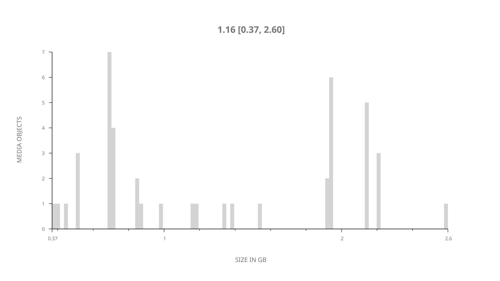
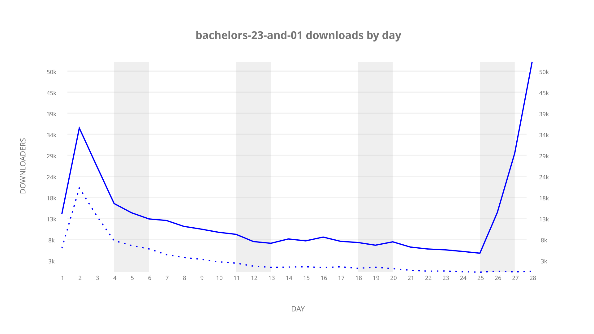
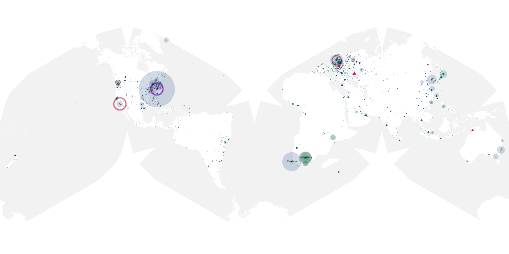
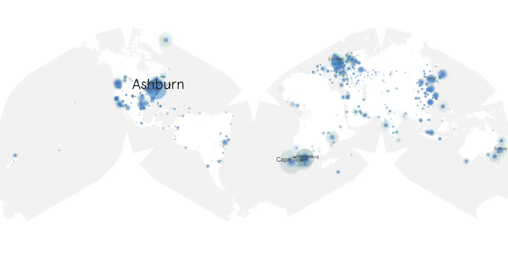

# bachelors-23-and-01 sample cache audit

## 1. Media object

| Field | Value |
| --- | --- |
| Media object | The Bachelors USA 23 UK 1 |
| Collection key | `bachelors-23-and-01` |
| imdb_id | [tt0313038](https://www.imdb.com/title/tt0313038/) |
| wikipedia_url | [The Bachelor (American TV series) season 23](https://en.wikipedia.org/wiki/The_Bachelor_(American_TV_series)_season_23) |
| Sample dates | 2019-03-12-to-2019-04-08 |
| Sample days | 28 |
| BTIH count | 58 |
| Unique BTIH count | 43 |
| Downloaders total | 353,810 |
| Uploaders total | 126,571 |
| Data version | `2026-08-05` |
| IP geolocation version | `6:1777968300` |

## 2. Coverage report

- Generated: 2026-09-06T23:35:37Z
- Evidence: read-only Day-member stream of the selected cache archive; no raw sample contents were opened
- Selected archive: cache.20190408.tar.xz
- Required sample span: 2019-03-12 to 2019-04-08 (28 days)
- Cache Day products: 28
- Sparse Day indices: 0
- Post-release Day products: 0

### Sample archive discontinuities

None detected.

## 3. File sizes histogram *median[lowest, highest]*

## 4. Graphs

### Downloads by week cumulative (normalized start)



### Downloads by day, Saturday and Sunday in gray

## 5. Cumulative Maps

<!-- https://raw.githubusercontent.com/alpha60-devops/alpha60-results-2019/refs/heads/main/data/ -->

### <a href="https://raw.githubusercontent.com/alpha60-devops/alpha60-results-2019/refs/heads/main/data/geojson.cumulative/bachelors-23-and-01-cumulative-aggregate.geojson.gz" data-map-title="The Bachelors USA 23 UK 1 — bachelors-23-and-01" onclick="leaflet_map_open_window(this.href, this.dataset.mapTitle); return false;" class="table-link" aria-label="Open The Bachelors USA 23 UK 1 (bachelors-23-and-01) cumulative data map in new window" title="Opens interactive map for The Bachelors USA 23 UK 1 (bachelors-23-and-01) data">Swarm Detail</a>

### Geographic Regions

| Africa | Americas | Asia | Europe | Oceania | Unknown |
| --- | --- | --- | --- | --- | --- |
| 9.63 | 30.37 | 16.25 | 22.53 | 3.03 | 5.48 |

### Network infrastructure

{:target="_blank" rel="noopener"}

### Resolution >= 1080p

{:target="_blank" rel="noopener"}

### Resolution < 1080p

{:target="_blank" rel="noopener"}
