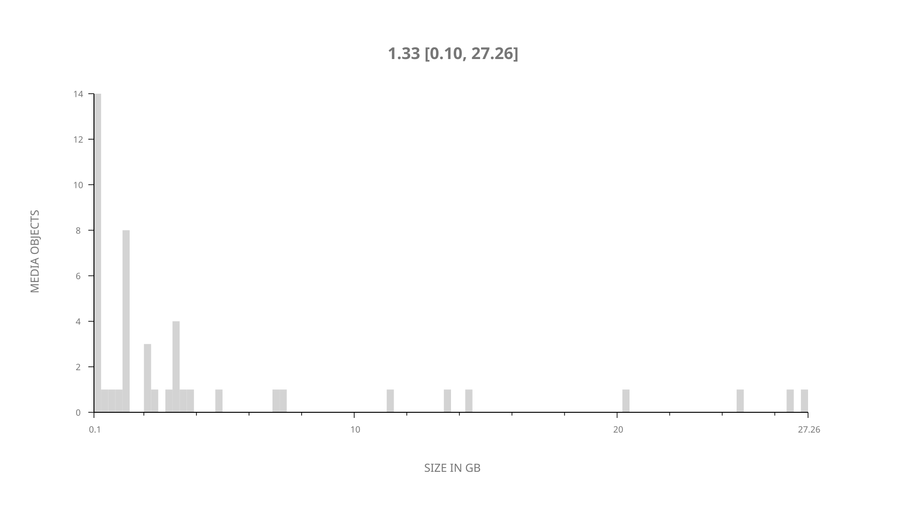
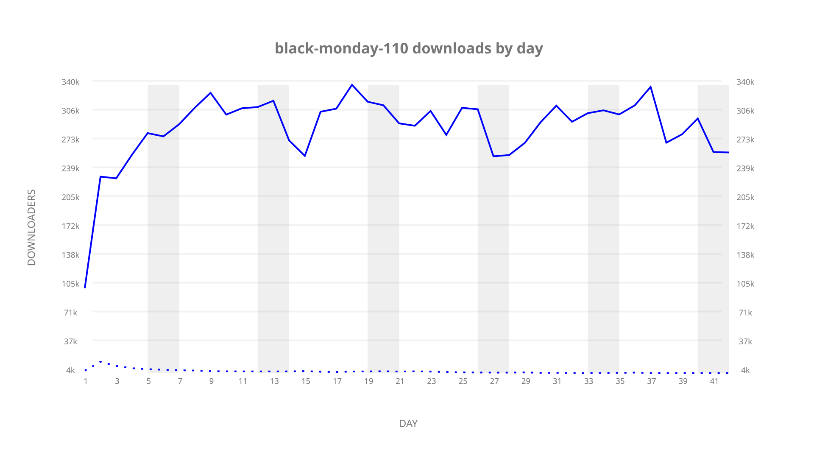
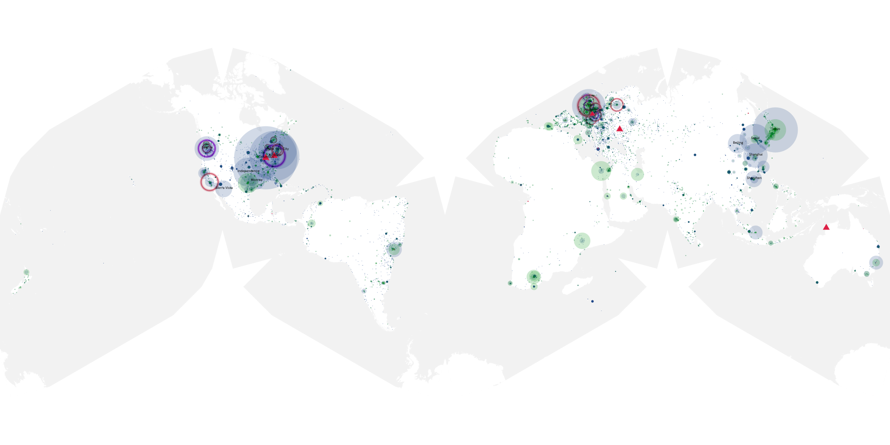
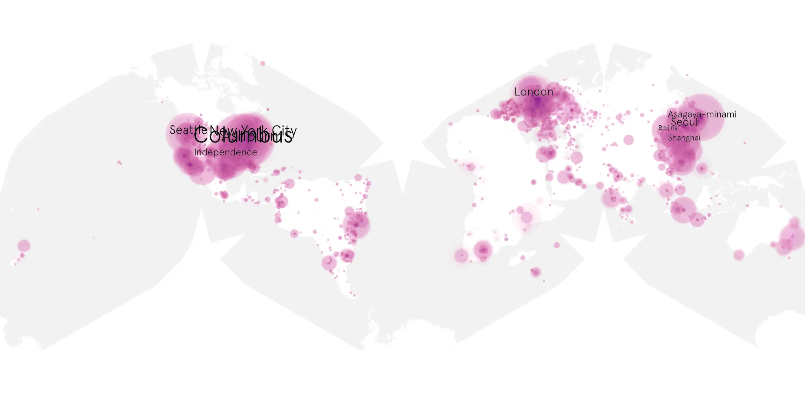
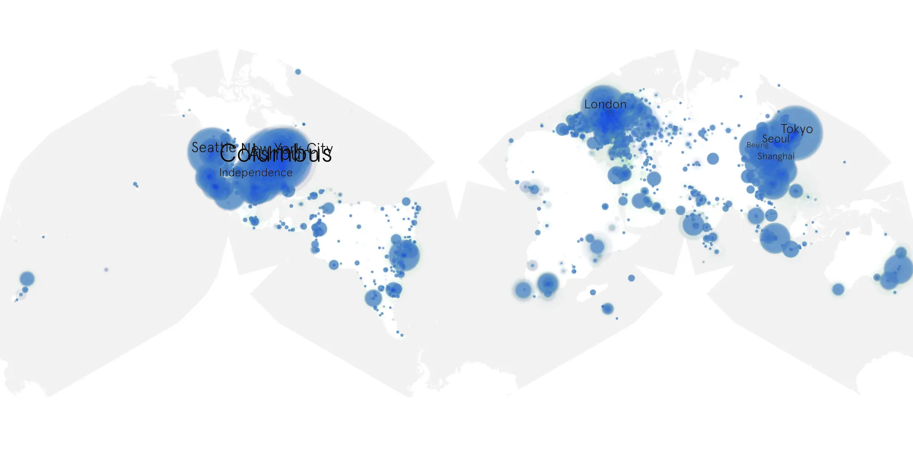

# black-monday-110 sample cache audit

## 1. Media object

| Field | Value |
| --- | --- |
| Media object | Black Monday |
| Collection key | `black-monday-110` |
| imdb_id | [tt7406334](https://www.imdb.com/title/tt7406334/) |
| wikipedia_url | [Black Monday (TV series)](https://en.wikipedia.org/wiki/Black_Monday_(TV_series)) |
| Sample dates | 2019-04-01-to-2019-05-12 |
| Sample days | 42 |
| BTIH count | 59 |
| Unique BTIH count | 46 |
| Downloaders total | 4,032,506 |
| Uploaders total | 164,571 |
| Data version | `2026-08-05` |
| IP geolocation version | `6:1777968300` |

## 2. Sample coverage report

- Generated: 2026-09-05T07:27:37Z
- Evidence: read-only Day-member stream of the selected cache archive; no raw sample contents were opened
- Selected archive: cache.20190512.tar.xz
- Required sample span: 2019-04-01 to 2019-05-12 (42 days)
- Cache Day products: 42
- Sparse Day indices: 0
- Post-release Day products: 0

### Sample archive discontinuities

None detected.

## 3. Media objects file size histogram

## 4. Visualization pass — graphs

### Downloads by week cumulative (normalized start)



### Downloads by day, Saturday and Sunday in gray

## 5. Visualization pass — maps

### Cumulative geographic slices

| Africa | Americas | Asia | Europe | Oceania | Unknown |
| --- | --- | --- | --- | --- | --- |
| 2.83 | 40.16 | 19.65 | 18.84 | 1.55 | 13.43 |

### Cumulative network infrastructure

{:target="_blank" rel="noopener"}

### Cumulative data maps

**Cumulative >= 1080p**

{:target="_blank" rel="noopener"}

**Cumulative < 1080p**

{:target="_blank" rel="noopener"}
