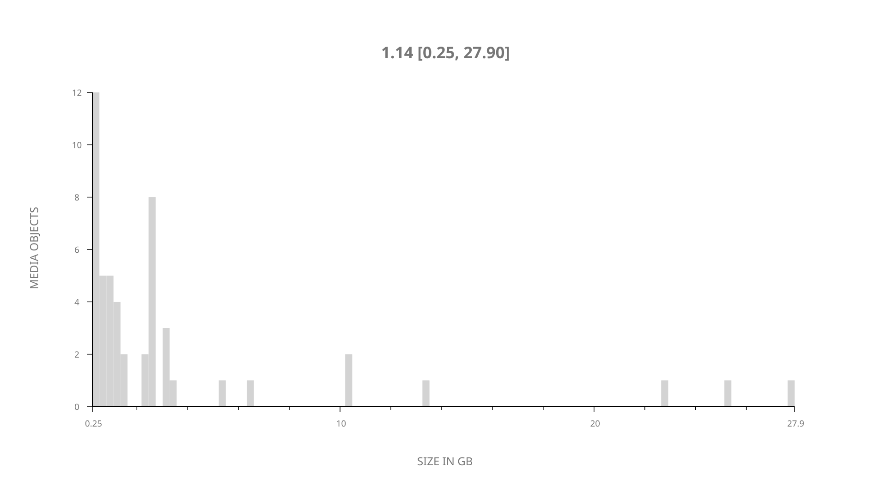
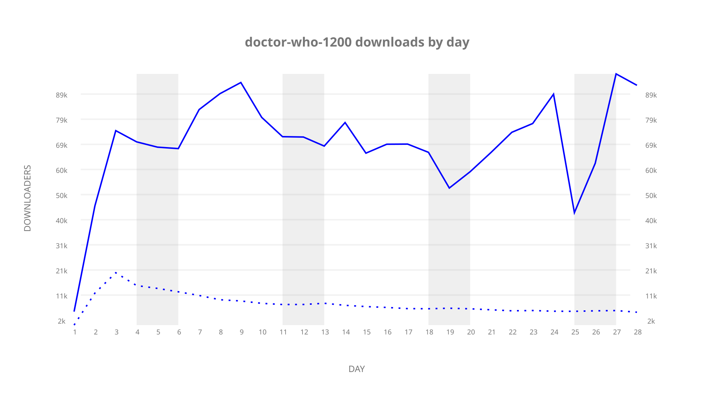
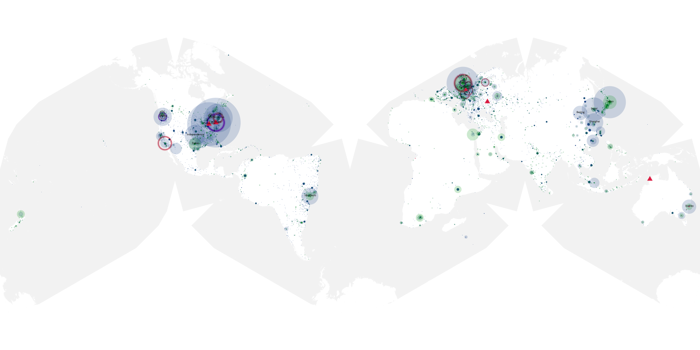
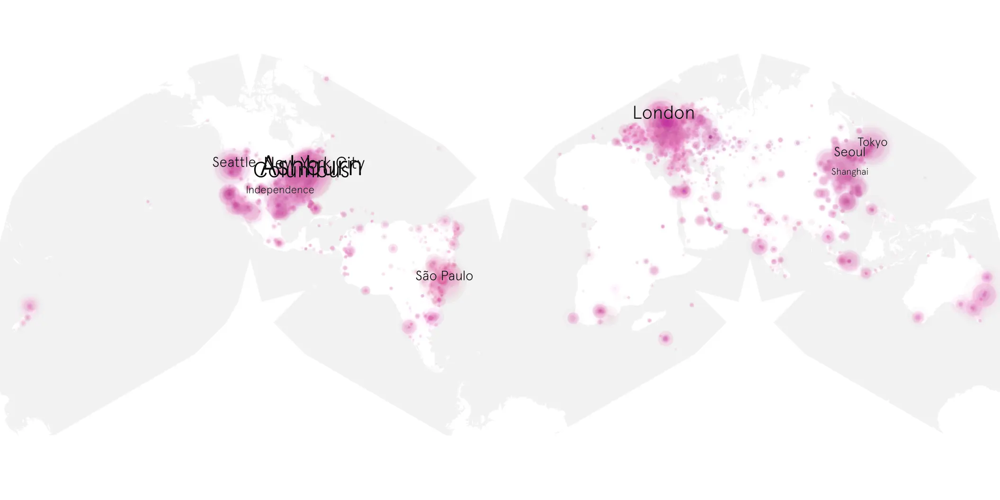
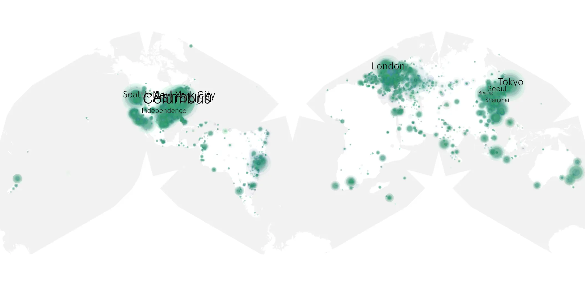

# doctor-who-1200 sample cache audit

## 1. Media object

| Field | Value |
| --- | --- |
| Media object | Doctor Who 2005 |
| Collection key | `doctor-who-1200` |
| imdb_id | [tt0436992](https://www.imdb.com/title/tt0436992/) |
| wikipedia_url | [Doctor Who series 12](https://en.wikipedia.org/wiki/Doctor_Who_series_12) |
| Sample dates | 2019-01-01-to-2019-01-28 |
| Sample days | 28 |
| BTIH count | 51 |
| Unique BTIH count | 50 |
| Downloaders total | 1,230,476 |
| Uploaders total | 142,343 |
| Data version | `2026-08-05` |
| IP geolocation version | `6:1777968300` |

## 2. Coverage report

- Generated: 2026-09-05T07:27:37Z
- Evidence: read-only Day-member stream of the selected cache archive; no raw sample contents were opened
- Selected archive: cache.20190128.tar.xz
- Required sample span: 2019-01-01 to 2019-01-28 (28 days)
- Cache Day products: 28
- Sparse Day indices: 0
- Post-release Day products: 0

### Sample archive discontinuities

None detected.

## 3. File sizes histogram *median[lowest, highest]*

## 4. Graphs

### Downloads by week cumulative (normalized start)



### Downloads by day, Saturday and Sunday in gray

## 5. Cumulative Maps

<!-- https://raw.githubusercontent.com/alpha60-devops/alpha60-results-2019/refs/heads/main/data/ -->

### <a href="https://raw.githubusercontent.com/alpha60-devops/alpha60-results-2019/refs/heads/main/data/geojson.cumulative/doctor-who-1200-cumulative-aggregate.geojson.gz" data-map-title="Doctor Who 2005 — doctor-who-1200" onclick="leaflet_map_open_window(this.href, this.dataset.mapTitle); return false;" class="table-link" aria-label="Open Doctor Who 2005 (doctor-who-1200) cumulative data map in new window" title="Opens interactive map for Doctor Who 2005 (doctor-who-1200) data">Swarm Detail</a>

### Geographic Regions

| Africa | Americas | Asia | Europe | Oceania | Unknown |
| --- | --- | --- | --- | --- | --- |
| 2.23 | 38.52 | 18.00 | 22.36 | 2.22 | 10.69 |

### Network infrastructure

{:target="_blank" rel="noopener"}

### Resolution >= 1080p

{:target="_blank" rel="noopener"}

### Resolution < 1080p

{:target="_blank" rel="noopener"}
