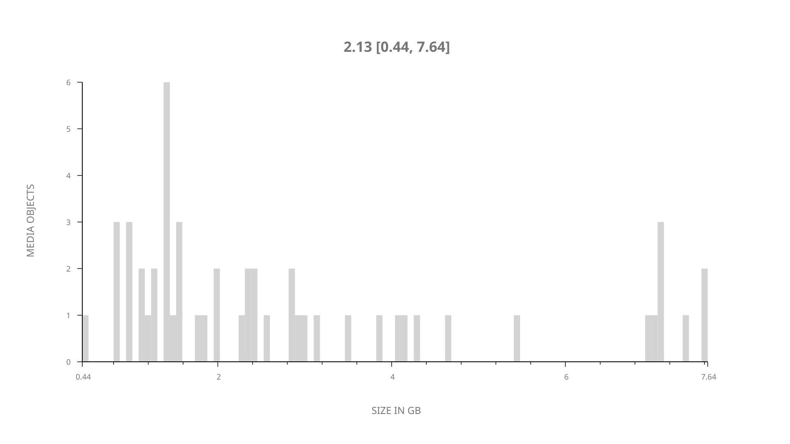
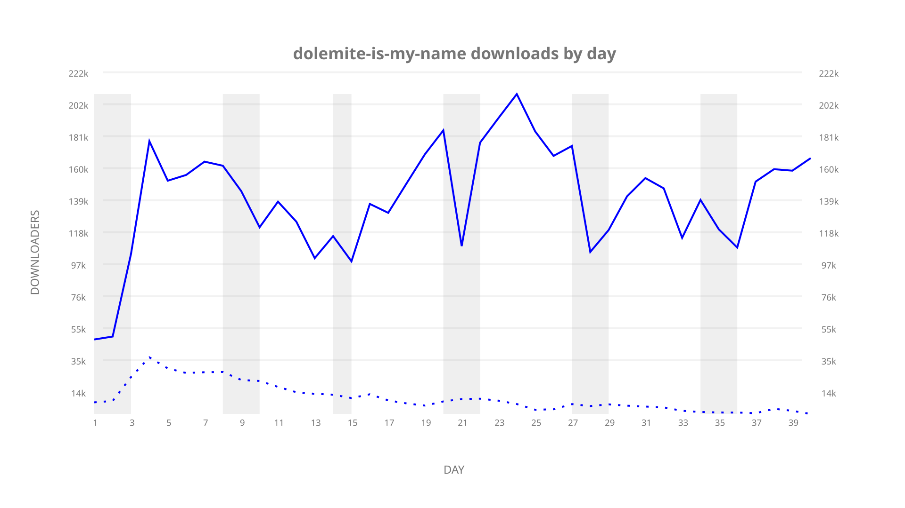
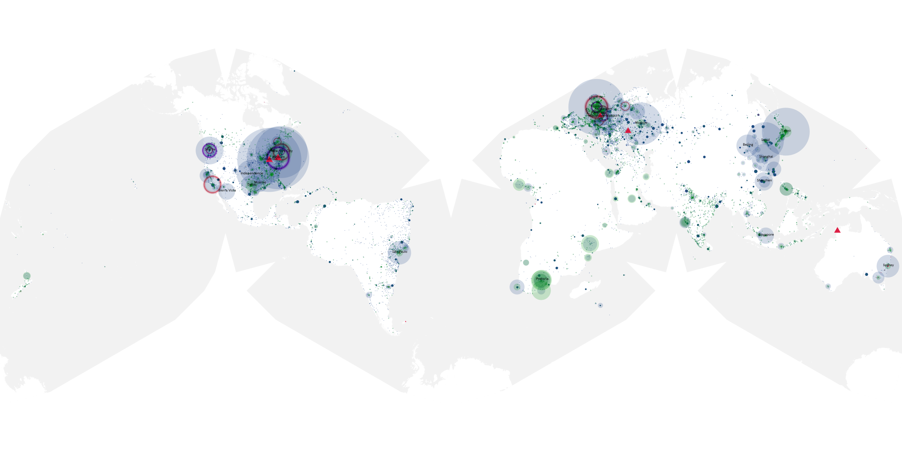
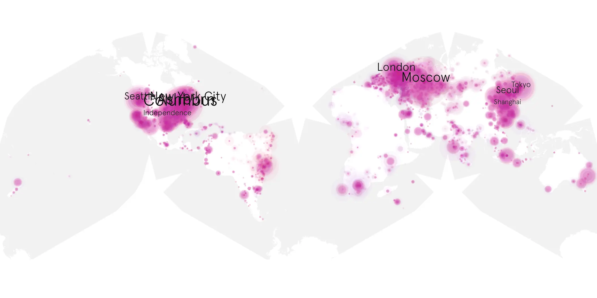
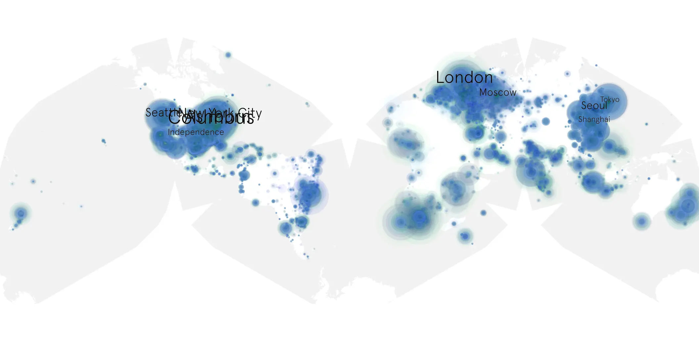

# dolemite-is-my-name sample cache audit

## 1. Media object

| Field | Value |
| --- | --- |
| Media object | Dolemite Is My Name |
| Collection key | `dolemite-is-my-name` |
| imdb_id | [tt8526872](https://www.imdb.com/title/tt8526872/) |
| wikipedia_url | [Dolemite Is My Name](https://en.wikipedia.org/wiki/Dolemite_Is_My_Name) |
| Sample dates | 2019-10-25-to-2019-12-05 |
| Sample days | 42 |
| BTIH count | 77 |
| Unique BTIH count | 52 |
| Downloaders total | 4,040,718 |
| Uploaders total | 655,658 |
| Data version | `2026-08-05` |
| IP geolocation version | `6:1777968300` |

## 2. Sample coverage report

- Generated: 2026-09-05T07:27:37Z
- Evidence: read-only Day-member stream of the selected cache archive; no raw sample contents were opened
- Selected archive: cache.20191205.tar.xz
- Required sample span: 2019-10-25 to 2019-12-05 (42 days)
- Cache Day products: 40
- Sparse Day indices: 2
- Post-release Day products: 0

### Sample archive discontinuities

- missing Day index: 15
- missing Day index: 16

## 3. Media objects file size histogram

## 4. Visualization pass — graphs

### Downloads by week cumulative (normalized start)



### Downloads by day, Saturday and Sunday in gray

## 5. Visualization pass — maps

### Cumulative geographic slices

| Africa | Americas | Asia | Europe | Oceania | Unknown |
| --- | --- | --- | --- | --- | --- |
| 5.44 | 33.90 | 18.83 | 25.31 | 1.97 | 9.16 |

### Cumulative network infrastructure

{:target="_blank" rel="noopener"}

### Cumulative data maps

**Cumulative >= 1080p**

{:target="_blank" rel="noopener"}

**Cumulative < 1080p**

{:target="_blank" rel="noopener"}
