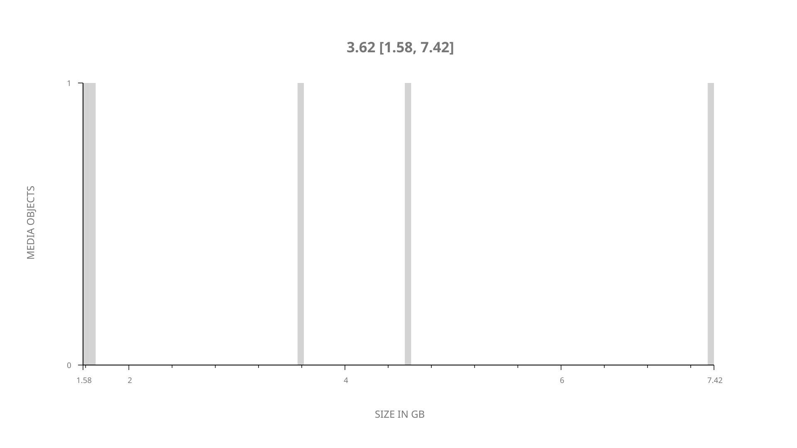
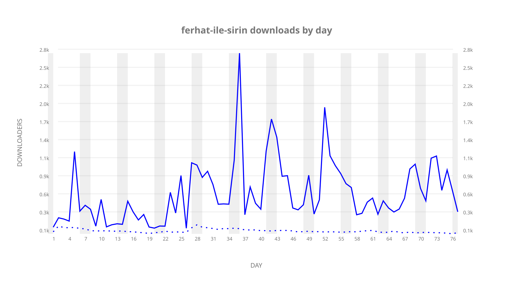
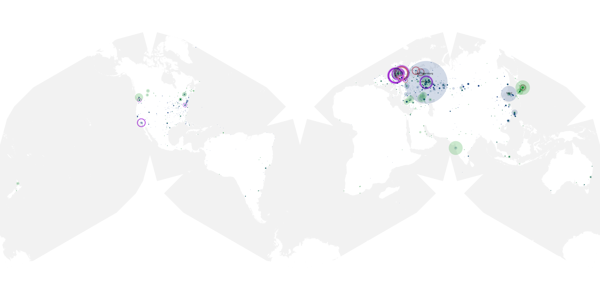
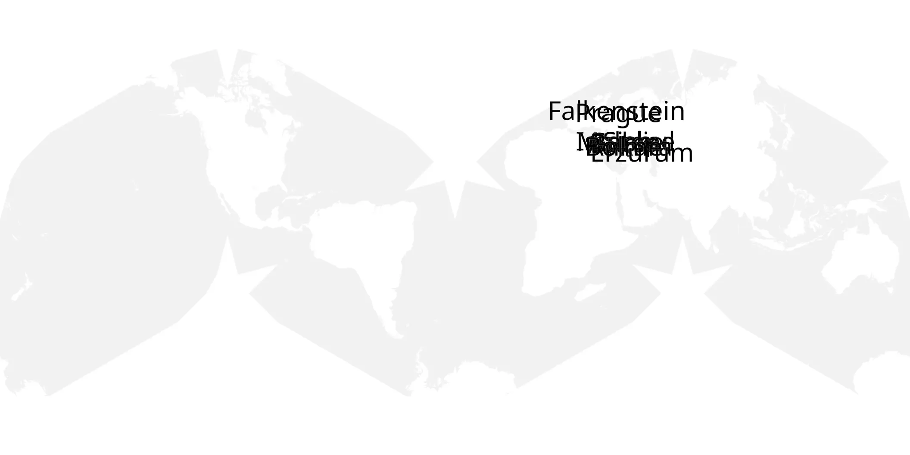
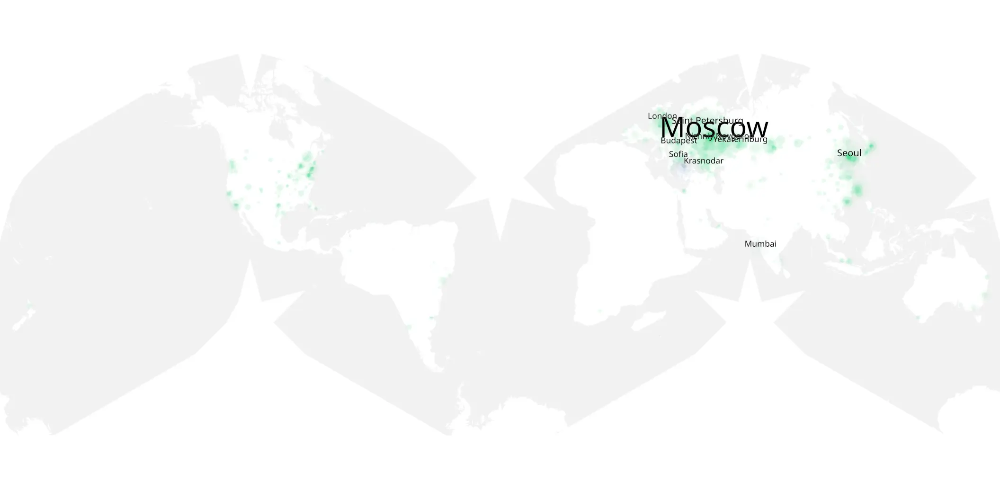

# ferhat-ile-sirin sample cache audit

## 1. Media object

| Field | Value |
| --- | --- |
| Media object | Ferhat Ile Sirin |
| Collection key | `ferhat-ile-sirin` |
| imdb_id | [tt11174344](https://www.imdb.com/title/tt11174344/) |
| wikipedia_url | UNAVAILABLE — no English Wikipedia page exists |
| Sample dates | 2019-11-24-to-2020-02-08 |
| Sample days | 77 |
| BTIH count | 5 |
| Unique BTIH count | 5 |
| Downloaders total | 41,592 |
| Uploaders total | 2,564 |
| Data version | `2026-08-05` |
| IP geolocation version | `6:1777968300` |

## 2. Sample coverage report

- Generated: 2026-09-05T07:27:37Z
- Evidence: read-only Day-member stream of the selected cache archive; no raw sample contents were opened
- Selected archive: cache.20200208.tar.xz
- Required sample span: 2019-11-24 to 2020-02-08 (77 days)
- Cache Day products: 77
- Sparse Day indices: 0
- Post-release Day products: 0

### Sample archive discontinuities

None detected.

## 3. Media objects file size histogram

## 4. Visualization pass — graphs

### Downloads by week cumulative (normalized start)



### Downloads by day, Saturday and Sunday in gray

## 5. Visualization pass — maps

### Cumulative geographic slices

| Africa | Americas | Asia | Europe | Oceania | Unknown |
| --- | --- | --- | --- | --- | --- |
| 0.19 | 8.87 | 10.73 | 29.20 | 0.37 | 1.11 |

### Cumulative network infrastructure

{:target="_blank" rel="noopener"}

### Cumulative data maps

**Cumulative >= 1080p**

{:target="_blank" rel="noopener"}

**Cumulative < 1080p**

{:target="_blank" rel="noopener"}
