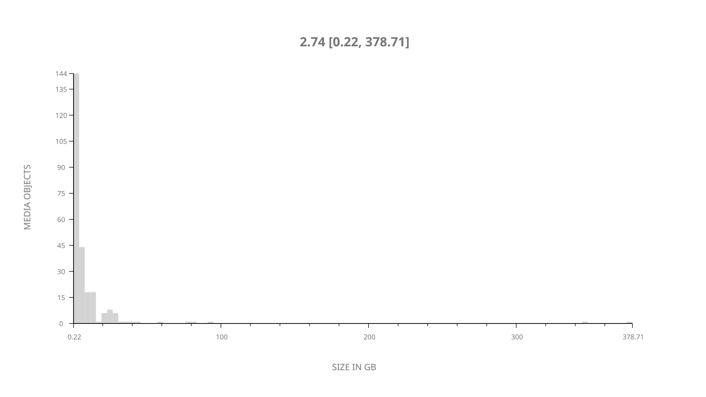
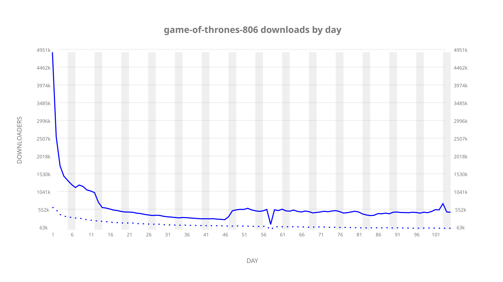
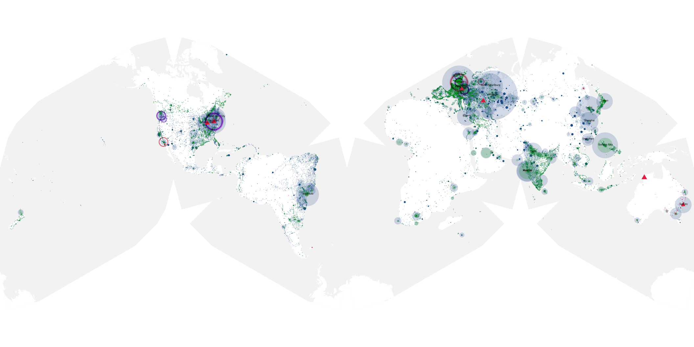
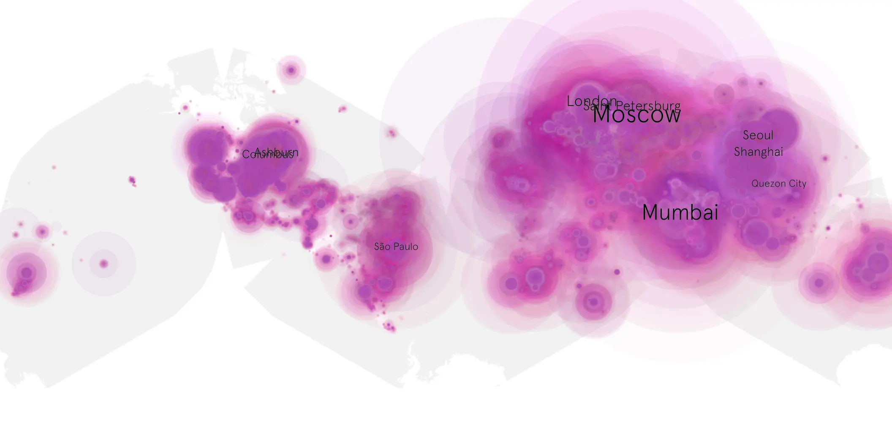
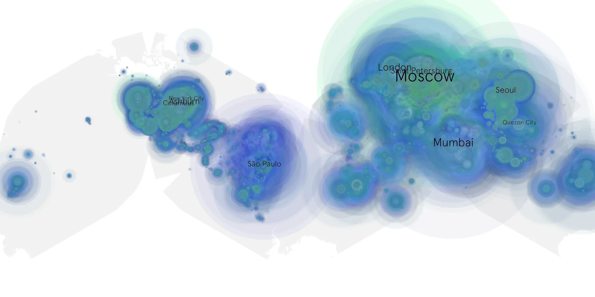

# game-of-thrones-806 sample cache audit

## 1. Media object

| Field | Value |
| --- | --- |
| Media object | Game of Thrones |
| Collection key | `game-of-thrones-806` |
| imdb_id | [tt0944947](https://www.imdb.com/title/tt0944947/) |
| wikipedia_url | [Game of Thrones](https://en.wikipedia.org/wiki/Game_of_Thrones) |
| Sample dates | 2019-05-20-to-2019-09-01 |
| Sample days | 105 |
| BTIH count | 311 |
| Unique BTIH count | 255 |
| Downloaders total | 44,484,798 |
| Uploaders total | 11,489,408 |
| Data version | `2026-08-05` |
| IP geolocation version | `6:1777968300` |

## 2. Coverage report

- Generated: 2026-09-05T07:27:37Z
- Evidence: read-only Day-member stream of the selected cache archive; no raw sample contents were opened
- Selected archive: cache.20190901.tar.xz
- Required sample span: 2019-05-20 to 2019-09-01 (105 days)
- Cache Day products: 105
- Sparse Day indices: 0
- Post-release Day products: 0

### Sample archive discontinuities

None detected.

## 3. File sizes histogram *median[lowest, highest]*

## 4. Graphs

### Downloads by week cumulative (normalized start)



### Downloads by day, Saturday and Sunday in gray

## 5. Cumulative Maps

<!-- https://raw.githubusercontent.com/alpha60-devops/alpha60-results-2019/refs/heads/main/data/ -->

### <a href="https://raw.githubusercontent.com/alpha60-devops/alpha60-results-2019/refs/heads/main/data/geojson.cumulative/game-of-thrones-806-cumulative-aggregate.geojson.gz" data-map-title="Game of Thrones — game-of-thrones-806" onclick="leaflet_map_open_window(this.href, this.dataset.mapTitle); return false;" class="table-link" aria-label="Open Game of Thrones (game-of-thrones-806) cumulative data map in new window" title="Opens interactive map for Game of Thrones (game-of-thrones-806) data">Swarm Detail</a>

### Geographic Regions

| Africa | Americas | Asia | Europe | Oceania | Unknown |
| --- | --- | --- | --- | --- | --- |
| 5.67 | 22.07 | 28.86 | 32.82 | 2.38 | 4.27 |

### Network infrastructure

{:target="_blank" rel="noopener"}

### Resolution >= 1080p

{:target="_blank" rel="noopener"}

### Resolution < 1080p

{:target="_blank" rel="noopener"}
