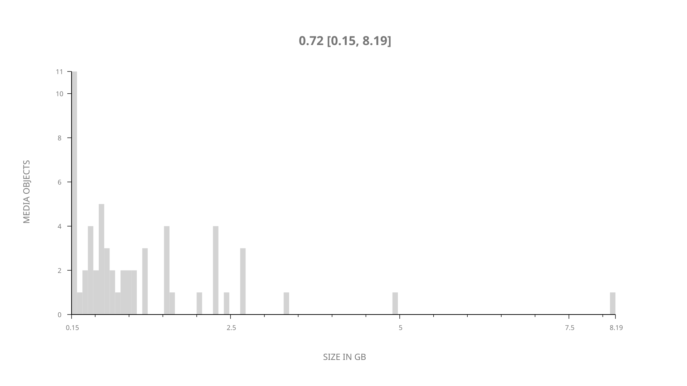
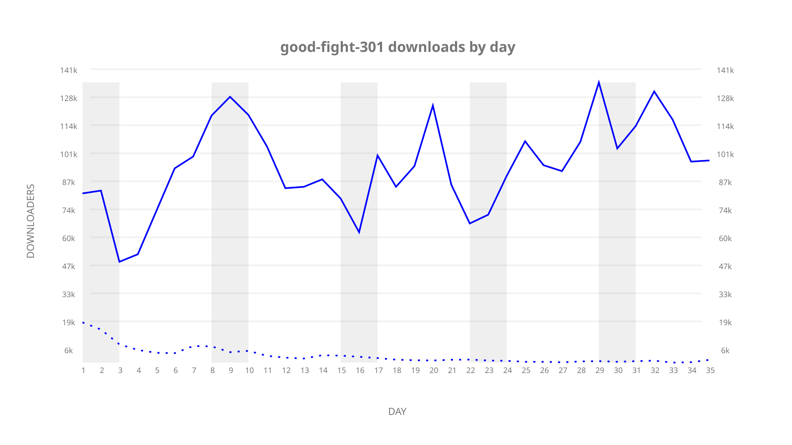
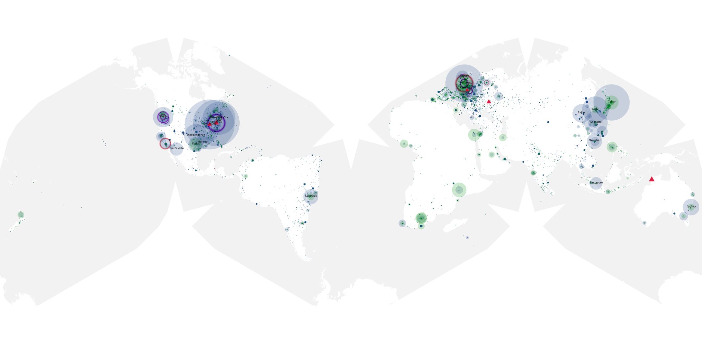
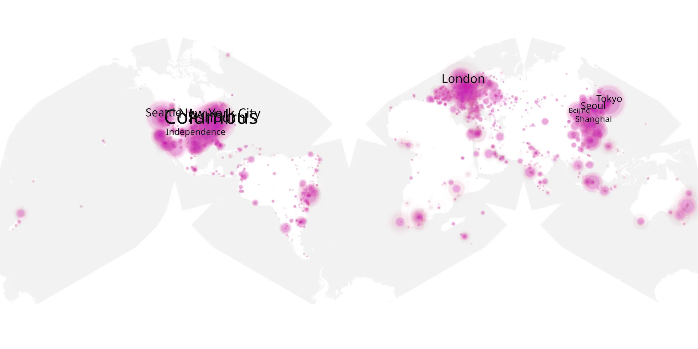
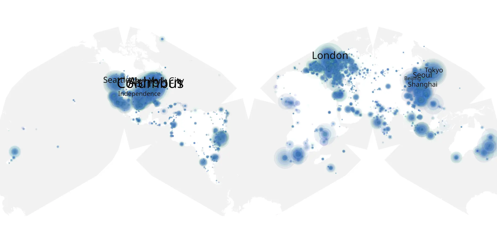

# good-fight-301 sample cache audit

## 1. Media object

| Field | Value |
| --- | --- |
| Media object | The Good Fight |
| Collection key | `good-fight-301` |
| imdb_id | [tt5853176](https://www.imdb.com/title/tt5853176/) |
| wikipedia_url | [The Good Fight](https://en.wikipedia.org/wiki/The_Good_Fight) |
| Sample dates | 2019-03-15-to-2019-04-18 |
| Sample days | 35 |
| BTIH count | 75 |
| Unique BTIH count | 57 |
| Downloaders total | 2,409,452 |
| Uploaders total | 267,933 |
| Data version | `2026-08-05` |
| IP geolocation version | `6:1777968300` |

## 2. Coverage report

- Generated: 2026-09-05T07:27:37Z
- Evidence: read-only Day-member stream of the selected cache archive; no raw sample contents were opened
- Selected archive: cache.20190418.tar.xz
- Required sample span: 2019-03-15 to 2019-04-18 (35 days)
- Cache Day products: 35
- Sparse Day indices: 0
- Post-release Day products: 0

### Sample archive discontinuities

None detected.

## 3. File sizes histogram *median[lowest, highest]*

## 4. Graphs

### Downloads by week cumulative (normalized start)



### Downloads by day, Saturday and Sunday in gray

## 5. Cumulative Maps

<!-- https://raw.githubusercontent.com/alpha60-devops/alpha60-results-2019/refs/heads/main/data/ -->

### <a href="https://raw.githubusercontent.com/alpha60-devops/alpha60-results-2019/refs/heads/main/data/geojson.cumulative/good-fight-301-cumulative-aggregate.geojson.gz" data-map-title="The Good Fight — good-fight-301" onclick="leaflet_map_open_window(this.href, this.dataset.mapTitle); return false;" class="table-link" aria-label="Open The Good Fight (good-fight-301) cumulative data map in new window" title="Opens interactive map for The Good Fight (good-fight-301) data">Swarm Detail</a>

### Geographic Regions

| Africa | Americas | Asia | Europe | Oceania | Unknown |
| --- | --- | --- | --- | --- | --- |
| 3.89 | 36.89 | 19.98 | 21.13 | 2.31 | 11.20 |

### Network infrastructure

{:target="_blank" rel="noopener"}

### Resolution >= 1080p

{:target="_blank" rel="noopener"}

### Resolution < 1080p

{:target="_blank" rel="noopener"}
