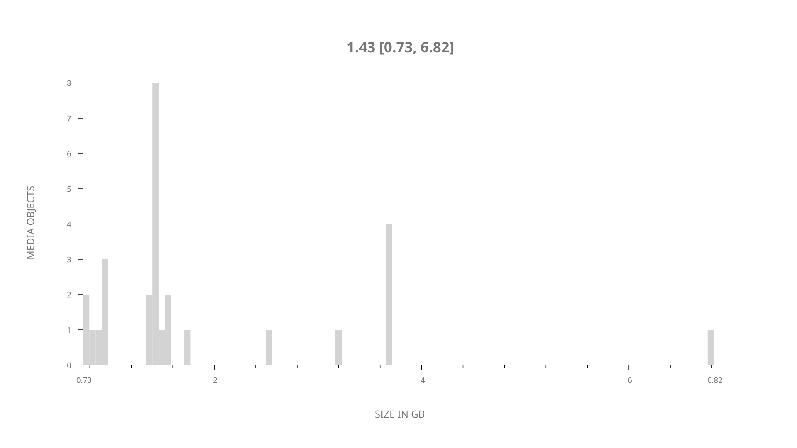
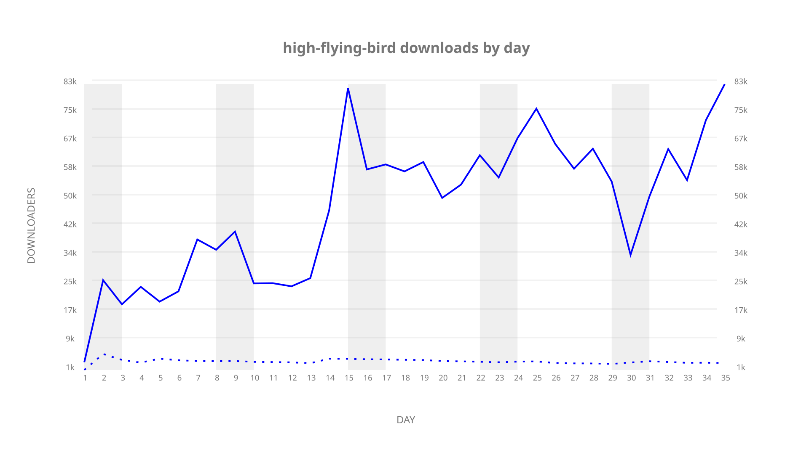
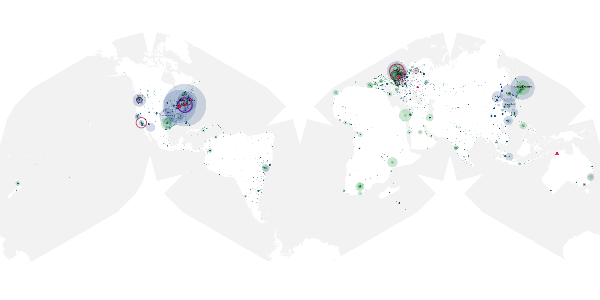
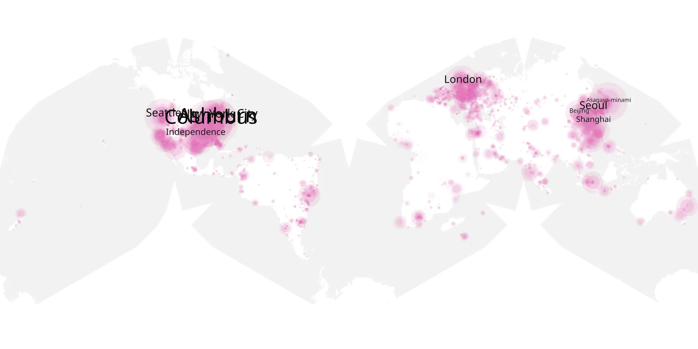
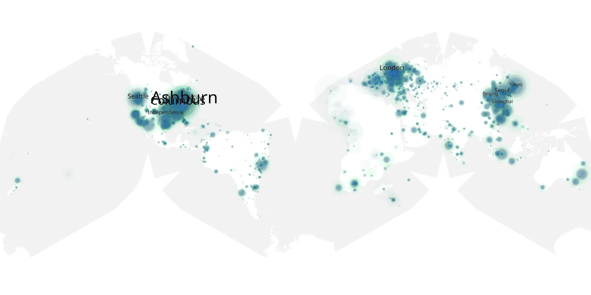

# high-flying-bird sample cache audit

## 1. Media object

| Field | Value |
| --- | --- |
| Media object | High Flying Bird |
| Collection key | `high-flying-bird` |
| imdb_id | [tt8128188](https://www.imdb.com/title/tt8128188/) |
| wikipedia_url | [High Flying Bird](https://en.wikipedia.org/wiki/High_Flying_Bird) |
| Sample dates | 2019-02-08-to-2019-03-14 |
| Sample days | 35 |
| BTIH count | 41 |
| Unique BTIH count | 28 |
| Downloaders total | 1,079,413 |
| Uploaders total | 82,793 |
| Data version | `2026-08-05` |
| IP geolocation version | `6:1777968300` |

## 2. Coverage report

- Generated: 2026-09-05T07:27:37Z
- Evidence: read-only Day-member stream of the selected cache archive; no raw sample contents were opened
- Selected archive: cache.20190314.tar.xz
- Required sample span: 2019-02-08 to 2019-03-14 (35 days)
- Cache Day products: 35
- Sparse Day indices: 0
- Post-release Day products: 0

### Sample archive discontinuities

None detected.

## 3. File sizes histogram *median[lowest, highest]*

## 4. Graphs

### Downloads by week cumulative (normalized start)



### Downloads by day, Saturday and Sunday in gray

## 5. Cumulative Maps

<!-- https://raw.githubusercontent.com/alpha60-devops/alpha60-results-2019/refs/heads/main/data/ -->

### <a href="https://raw.githubusercontent.com/alpha60-devops/alpha60-results-2019/refs/heads/main/data/geojson.cumulative/high-flying-bird-cumulative-aggregate.geojson.gz" data-map-title="High Flying Bird — high-flying-bird" onclick="leaflet_map_open_window(this.href, this.dataset.mapTitle); return false;" class="table-link" aria-label="Open High Flying Bird (high-flying-bird) cumulative data map in new window" title="Opens interactive map for High Flying Bird (high-flying-bird) data">Swarm Detail</a>

### Geographic Regions

| Africa | Americas | Asia | Europe | Oceania | Unknown |
| --- | --- | --- | --- | --- | --- |
| 4.70 | 36.70 | 18.76 | 18.48 | 1.49 | 11.53 |

### Network infrastructure

{:target="_blank" rel="noopener"}

### Resolution >= 1080p

{:target="_blank" rel="noopener"}

### Resolution < 1080p

{:target="_blank" rel="noopener"}
