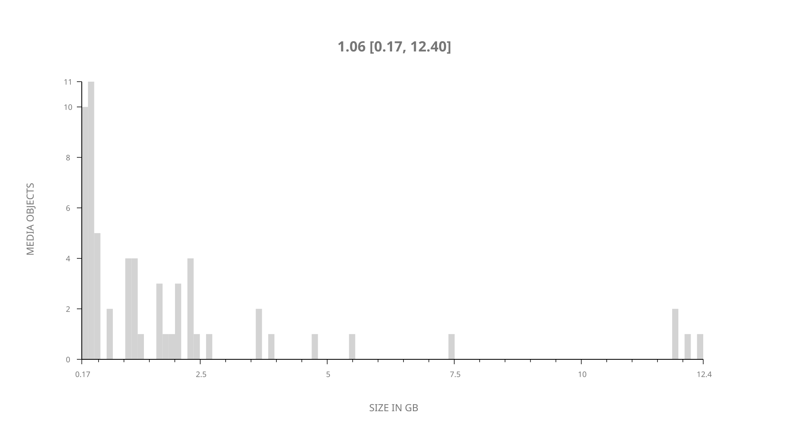
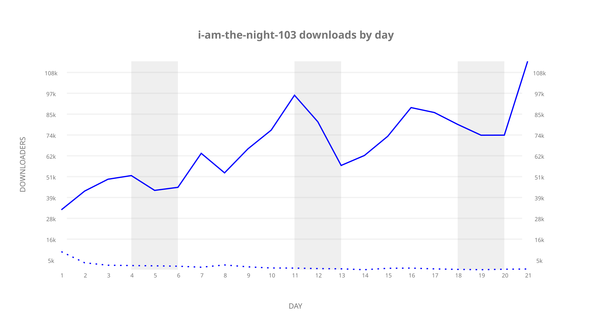
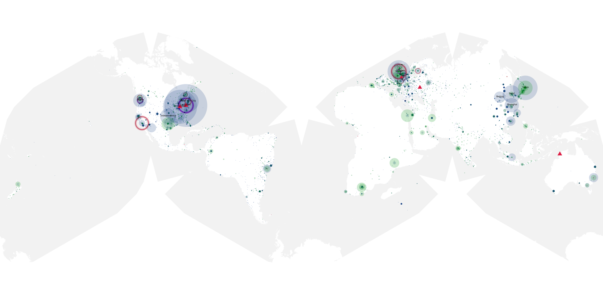
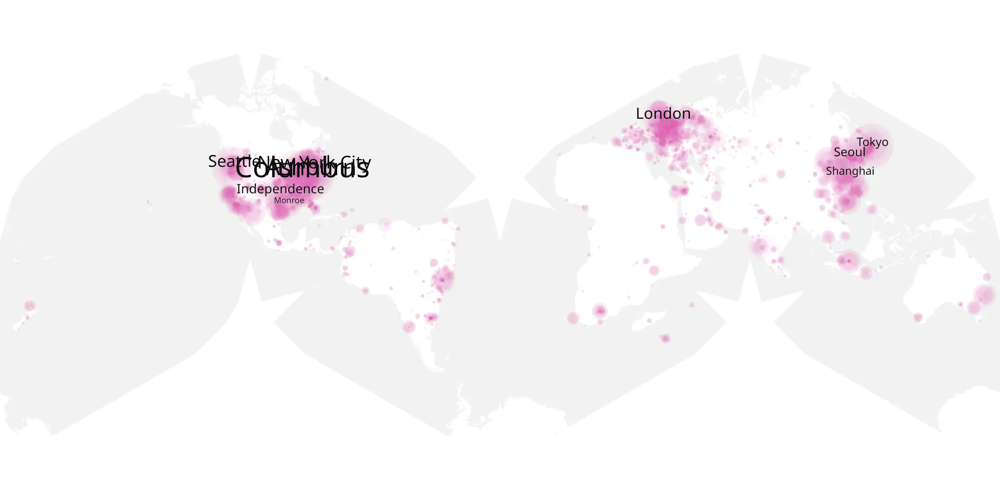
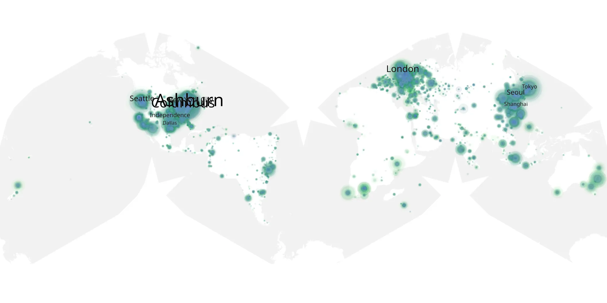

# i-am-the-night-103 sample cache audit

## 1. Media object

| Field | Value |
| --- | --- |
| Media object | I Am The Night |
| Collection key | `i-am-the-night-103` |
| imdb_id | [tt7186588](https://www.imdb.com/title/tt7186588/) |
| wikipedia_url | [I Am the Night (TV series)](https://en.wikipedia.org/wiki/I_Am_the_Night_(TV_series)) |
| Sample dates | 2019-02-12-to-2019-03-04 |
| Sample days | 21 |
| BTIH count | 76 |
| Unique BTIH count | 61 |
| Downloaders total | 1,193,643 |
| Uploaders total | 107,964 |
| Data version | `2026-08-05` |
| IP geolocation version | `6:1777968300` |

## 2. Coverage report

- Generated: 2026-09-06T23:35:37Z
- Evidence: read-only Day-member stream of the selected cache archive; no raw sample contents were opened
- Selected archive: cache.20190304.tar.xz
- Required sample span: 2019-02-12 to 2019-03-04 (21 days)
- Cache Day products: 21
- Sparse Day indices: 0
- Post-release Day products: 0

### Sample archive discontinuities

None detected.

## 3. File sizes histogram *median[lowest, highest]*

## 4. Graphs

### Downloads by week cumulative (normalized start)



### Downloads by day, Saturday and Sunday in gray

## 5. Cumulative Maps

<!-- https://raw.githubusercontent.com/alpha60-devops/alpha60-results-2019/refs/heads/main/data/ -->

### <a href="https://raw.githubusercontent.com/alpha60-devops/alpha60-results-2019/refs/heads/main/data/geojson.cumulative/i-am-the-night-103-cumulative-aggregate.geojson.gz" data-map-title="I Am The Night — i-am-the-night-103" onclick="leaflet_map_open_window(this.href, this.dataset.mapTitle); return false;" class="table-link" aria-label="Open I Am The Night (i-am-the-night-103) cumulative data map in new window" title="Opens interactive map for I Am The Night (i-am-the-night-103) data">Swarm Detail</a>

### Geographic Regions

| Africa | Americas | Asia | Europe | Oceania | Unknown |
| --- | --- | --- | --- | --- | --- |
| 2.86 | 37.93 | 18.96 | 19.96 | 1.93 | 11.53 |

### Network infrastructure

{:target="_blank" rel="noopener"}

### Resolution >= 1080p

{:target="_blank" rel="noopener"}

### Resolution < 1080p

{:target="_blank" rel="noopener"}
