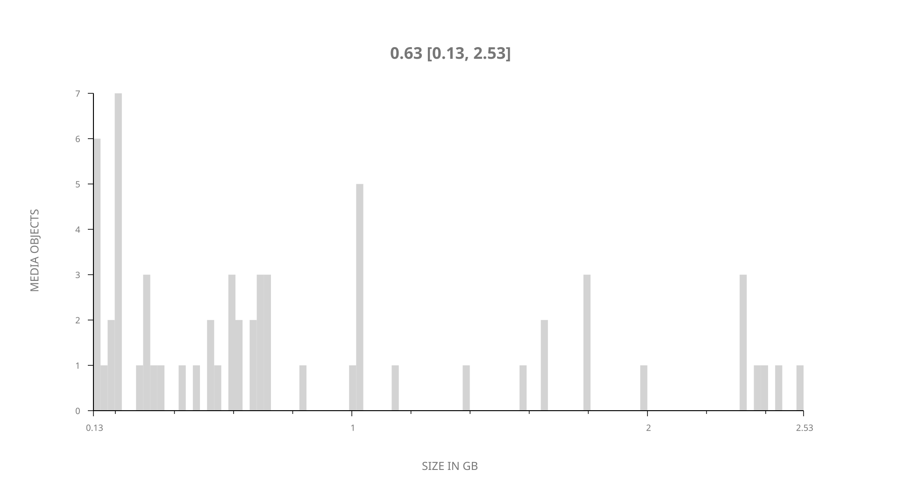
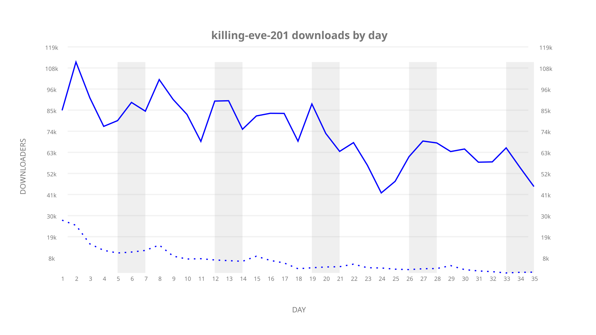
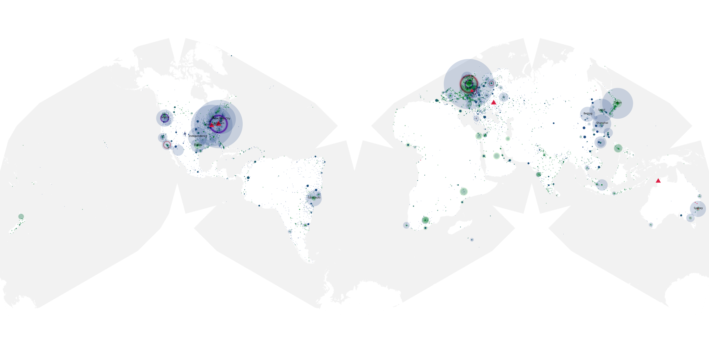
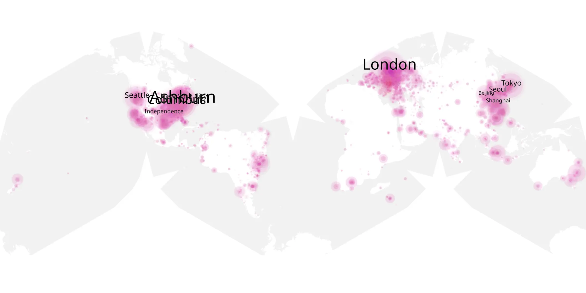
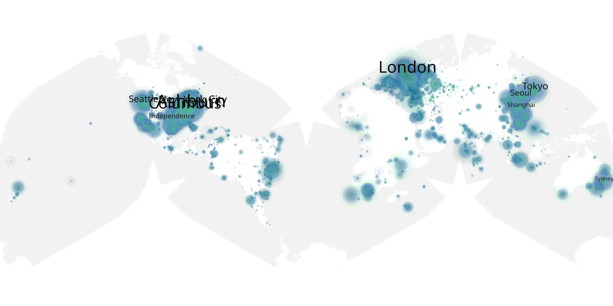

# killing-eve-201 sample cache audit

## 1. Media object

| Field | Value |
| --- | --- |
| Media object | Killing Eve |
| Collection key | `killing-eve-201` |
| imdb_id | [tt7016936](https://www.imdb.com/title/tt7016936/) |
| wikipedia_url | [Killing Eve](https://en.wikipedia.org/wiki/Killing_Eve) |
| Sample dates | 2019-04-08-to-2019-05-12 |
| Sample days | 35 |
| BTIH count | 70 |
| Unique BTIH count | 63 |
| Downloaders total | 1,963,188 |
| Uploaders total | 326,382 |
| Data version | `2026-08-05` |
| IP geolocation version | `6:1777968300` |

## 2. Coverage report

- Generated: 2026-09-06T23:35:37Z
- Evidence: read-only Day-member stream of the selected cache archive; no raw sample contents were opened
- Selected archive: cache.20190512.tar.xz
- Required sample span: 2019-04-08 to 2019-05-12 (35 days)
- Cache Day products: 35
- Sparse Day indices: 0
- Post-release Day products: 0

### Sample archive discontinuities

None detected.

## 3. File sizes histogram *median[lowest, highest]*

## 4. Graphs

### Downloads by week cumulative (normalized start)



### Downloads by day, Saturday and Sunday in gray

## 5. Cumulative Maps

<!-- https://raw.githubusercontent.com/alpha60-devops/alpha60-results-2019/refs/heads/main/data/ -->

### <a href="https://raw.githubusercontent.com/alpha60-devops/alpha60-results-2019/refs/heads/main/data/geojson.cumulative/killing-eve-201-cumulative-aggregate.geojson.gz" data-map-title="Killing Eve — killing-eve-201" onclick="leaflet_map_open_window(this.href, this.dataset.mapTitle); return false;" class="table-link" aria-label="Open Killing Eve (killing-eve-201) cumulative data map in new window" title="Opens interactive map for Killing Eve (killing-eve-201) data">Swarm Detail</a>

### Geographic Regions

| Africa | Americas | Asia | Europe | Oceania | Unknown |
| --- | --- | --- | --- | --- | --- |
| 3.49 | 35.40 | 18.38 | 23.22 | 2.33 | 9.75 |

### Network infrastructure

{:target="_blank" rel="noopener"}

### Resolution >= 1080p

{:target="_blank" rel="noopener"}

### Resolution < 1080p

{:target="_blank" rel="noopener"}
