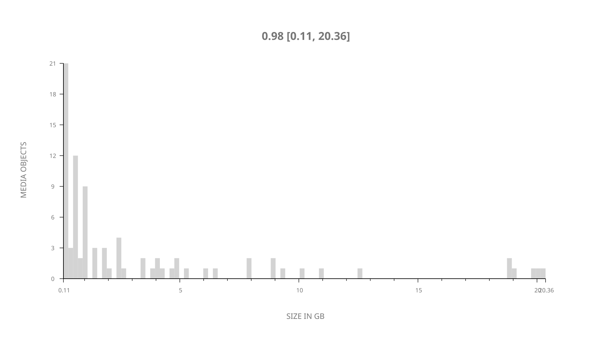
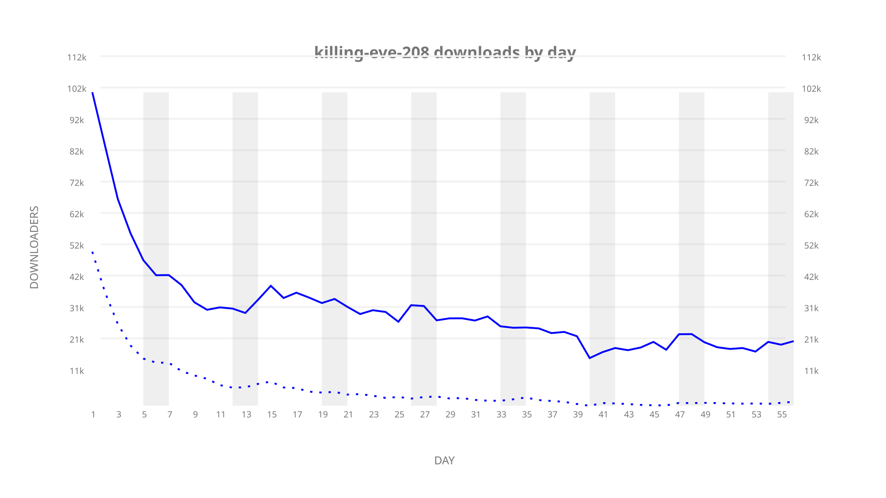
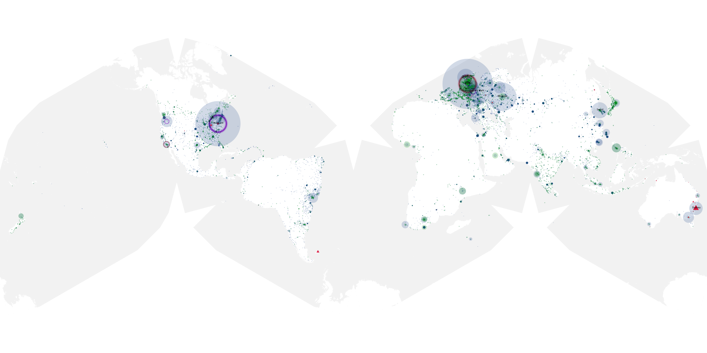
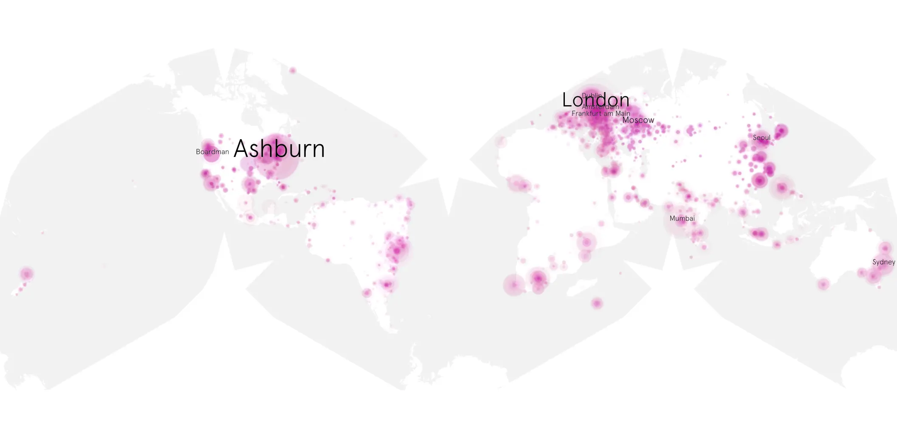
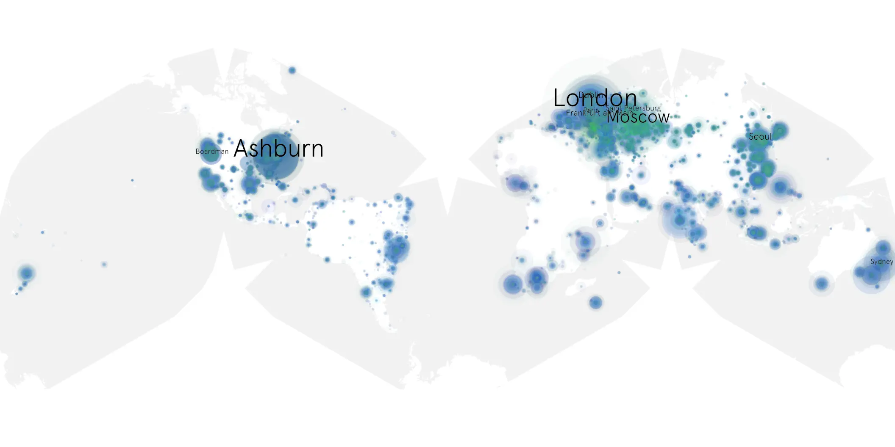

# killing-eve-208 sample cache audit

## 1. Media object

| Field | Value |
| --- | --- |
| Media object | Killing Eve |
| Collection key | `killing-eve-208` |
| imdb_id | [tt7016936](https://www.imdb.com/title/tt7016936/) |
| wikipedia_url | [Killing Eve](https://en.wikipedia.org/wiki/Killing_Eve) |
| Sample dates | 2019-05-27-to-2019-07-21 |
| Sample days | 56 |
| BTIH count | 105 |
| Unique BTIH count | 85 |
| Downloaders total | 1,586,541 |
| Uploaders total | 603,432 |
| Data version | `2026-08-05` |
| IP geolocation version | `6:1777968300` |

## 2. Sample coverage report

- Generated: 2026-09-05T07:27:37Z
- Evidence: read-only Day-member stream of the selected cache archive; no raw sample contents were opened
- Selected archive: cache.20190721.tar.xz
- Required sample span: 2019-05-27 to 2019-07-21 (56 days)
- Cache Day products: 56
- Sparse Day indices: 0
- Post-release Day products: 0

### Sample archive discontinuities

None detected.

## 3. Media objects file size histogram

## 4. Visualization pass — graphs

### Downloads by week cumulative (normalized start)



### Downloads by day, Saturday and Sunday in gray

## 5. Visualization pass — maps

### Cumulative geographic slices

| Africa | Americas | Asia | Europe | Oceania | Unknown |
| --- | --- | --- | --- | --- | --- |
| 4.72 | 23.89 | 19.55 | 39.00 | 3.69 | 2.74 |

### Cumulative network infrastructure

{:target="_blank" rel="noopener"}

### Cumulative data maps

**Cumulative >= 1080p**

{:target="_blank" rel="noopener"}

**Cumulative < 1080p**

{:target="_blank" rel="noopener"}
