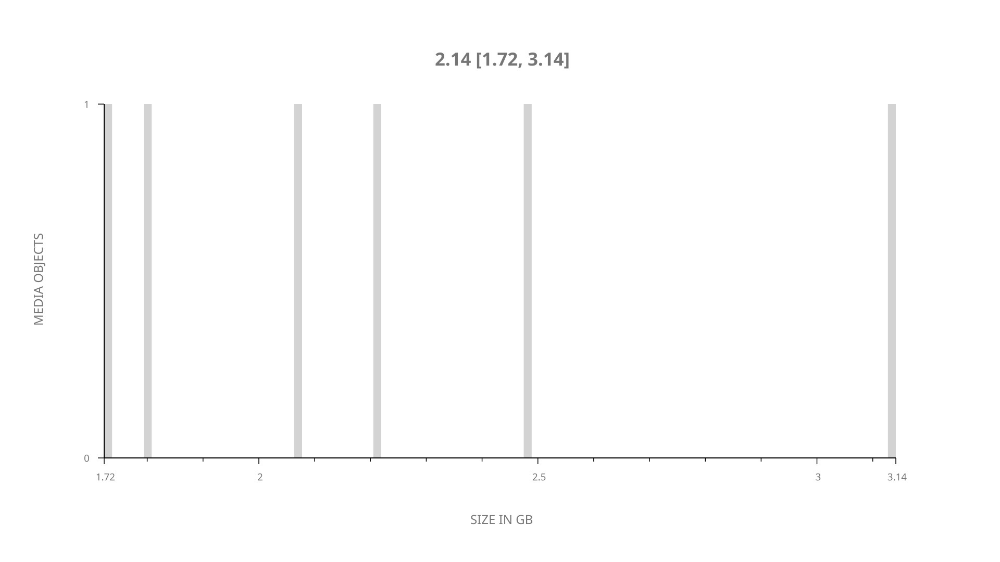
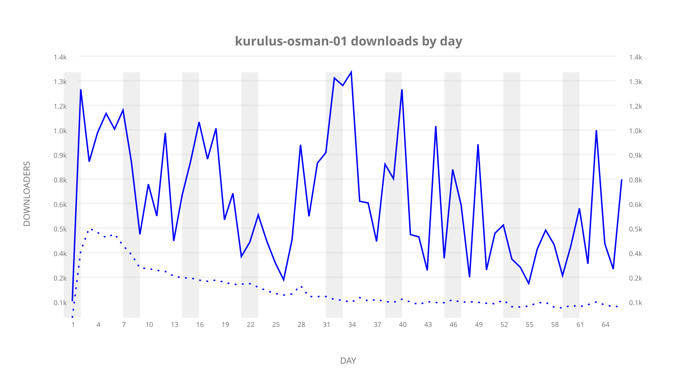
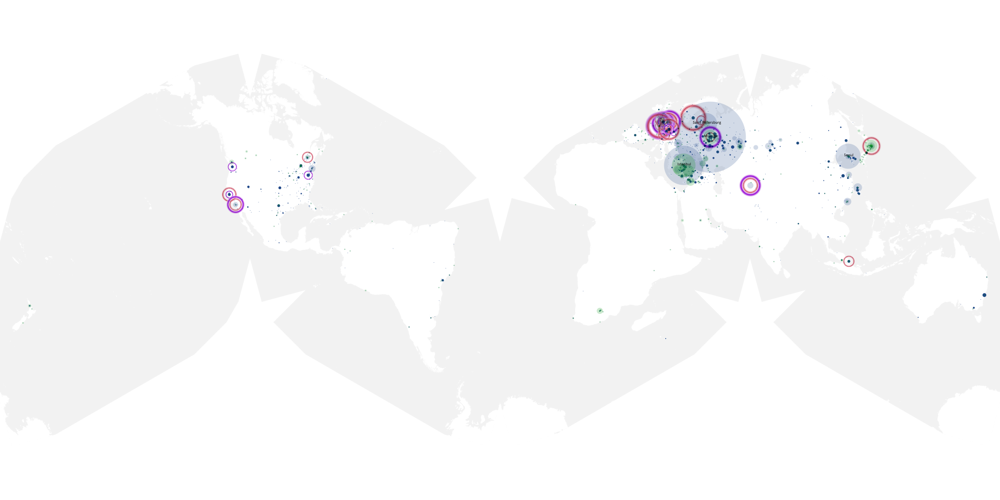
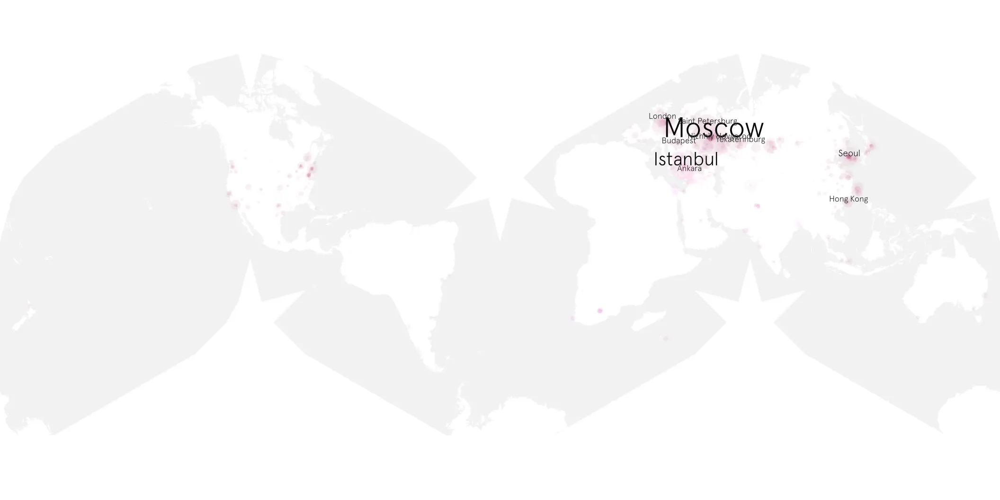
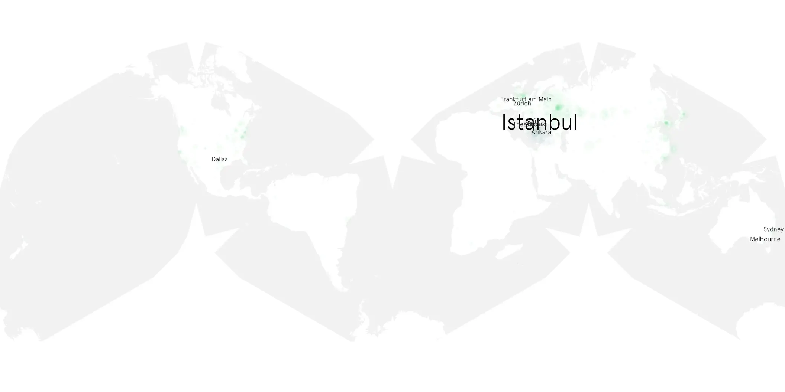

# kurulus-osman-01 sample cache audit

## 1. Media object

| Field | Value |
| --- | --- |
| Media object | Kurulus Osman |
| Collection key | `kurulus-osman-01` |
| imdb_id | [tt11093718](https://www.imdb.com/title/tt11093718/) |
| wikipedia_url | [Kuruluş: Osman](https://en.wikipedia.org/wiki/Kurulu%C5%9F:_Osman) |
| Sample dates | 2019-11-23-to-2020-02-07 |
| Sample days | 77 |
| BTIH count | 6 |
| Unique BTIH count | 6 |
| Downloaders total | 33,229 |
| Uploaders total | 5,696 |
| Data version | `2026-08-05` |
| IP geolocation version | `6:1777968300` |

## 2. Sample coverage report

- Generated: 2026-09-05T07:27:37Z
- Evidence: read-only Day-member stream of the selected cache archive; no raw sample contents were opened
- Selected archive: cache.20200207.tar.xz
- Required sample span: 2019-11-23 to 2020-02-07 (77 days)
- Cache Day products: 66
- Sparse Day indices: 11
- Post-release Day products: 0

### Sample archive discontinuities

- missing Day index: 29
- missing Day index: 30
- missing Day index: 31
- missing Day index: 32
- missing Day index: 33
- missing Day index: 34
- missing Day index: 35
- missing Day index: 36
- missing Day index: 37
- missing Day index: 38
- missing Day index: 39

## 3. Media objects file size histogram

## 4. Visualization pass — graphs

### Downloads by week cumulative (normalized start)



### Downloads by day, Saturday and Sunday in gray

## 5. Visualization pass — maps

### Cumulative geographic slices

| Africa | Americas | Asia | Europe | Oceania | Unknown |
| --- | --- | --- | --- | --- | --- |
| 0.84 | 9.41 | 22.87 | 29.19 | 0.69 | 1.84 |

### Cumulative network infrastructure

{:target="_blank" rel="noopener"}

### Cumulative data maps

**Cumulative >= 1080p**

{:target="_blank" rel="noopener"}

**Cumulative < 1080p**

{:target="_blank" rel="noopener"}
