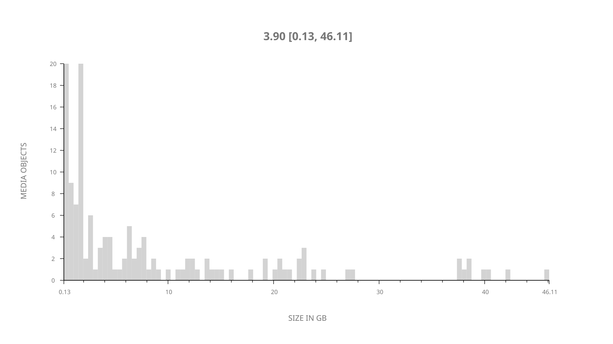
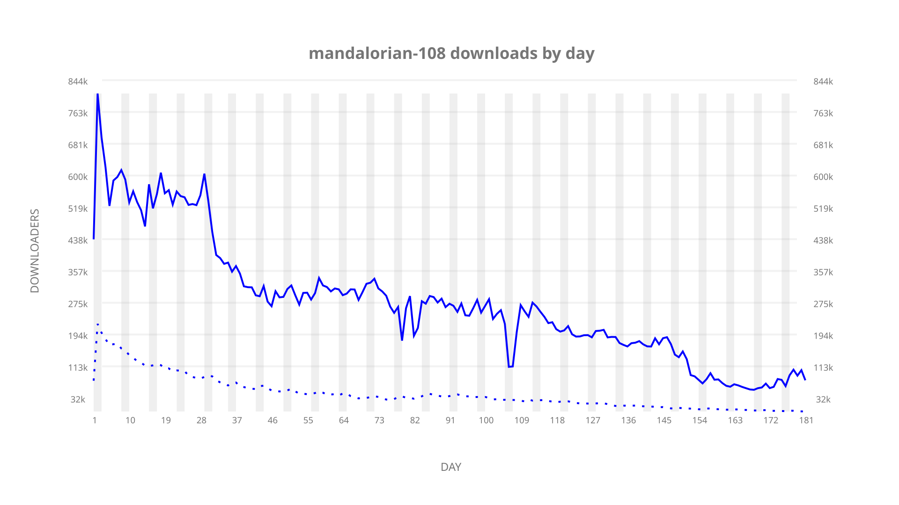
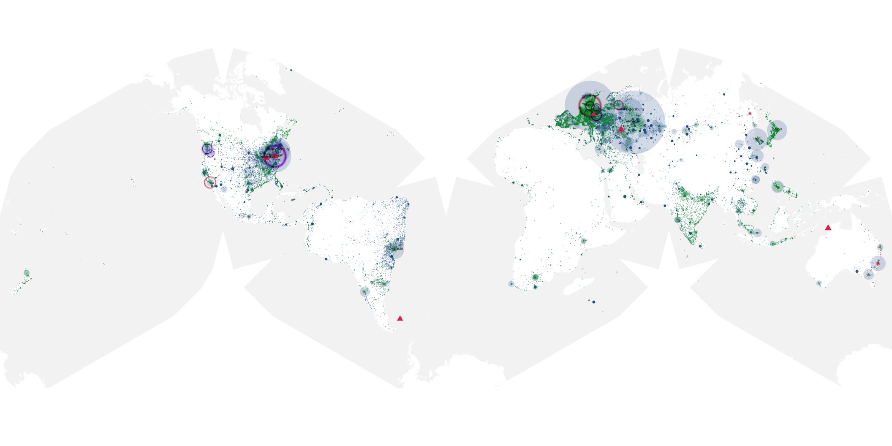
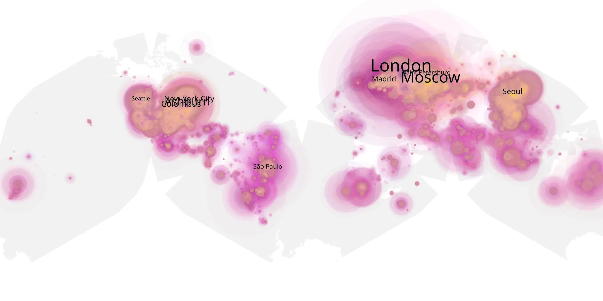
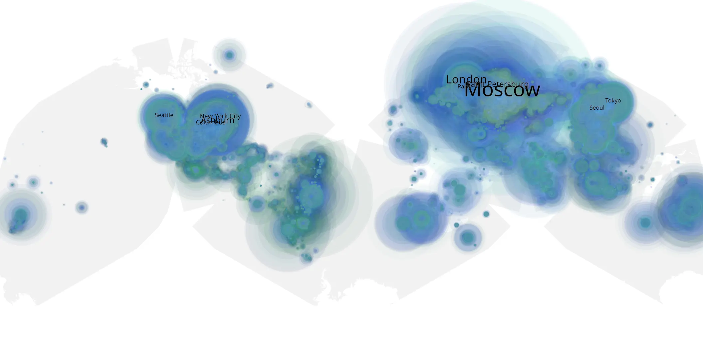

# mandalorian-108 sample cache audit

## 1. Media object

| Field | Value |
| --- | --- |
| Media object | The Mandalorian |
| Collection key | `mandalorian-108` |
| imdb_id | [tt8111088](https://www.imdb.com/title/tt8111088/) |
| wikipedia_url | [The Mandalorian](https://en.wikipedia.org/wiki/The_Mandalorian) |
| Sample dates | 2019-12-27-to-2020-06-25 |
| Sample days | 182 |
| BTIH count | 170 |
| Unique BTIH count | 138 |
| Downloaders total | 28,474,342 |
| Uploaders total | 7,481,931 |
| Data version | `2026-08-05` |
| IP geolocation version | `6:1777968300` |

## 2. Sample coverage report

- Generated: 2026-09-05T07:27:37Z
- Evidence: read-only Day-member stream of the selected cache archive; no raw sample contents were opened
- Selected archive: cache.20200625.tar.xz
- Required sample span: 2019-12-27 to 2020-06-25 (182 days)
- Cache Day products: 181
- Sparse Day indices: 1
- Post-release Day products: 0

### Sample archive discontinuities

- missing Day index: 36

## 3. Media objects file size histogram

## 4. Visualization pass — graphs

### Downloads by week cumulative (normalized start)



### Downloads by day, Saturday and Sunday in gray

## 5. Visualization pass — maps

### Cumulative geographic slices

| Africa | Americas | Asia | Europe | Oceania | Unknown |
| --- | --- | --- | --- | --- | --- |
| 2.87 | 27.69 | 16.58 | 42.08 | 2.26 | 5.15 |

### Cumulative network infrastructure

{:target="_blank" rel="noopener"}

### Cumulative data maps

**Cumulative >= 1080p**

{:target="_blank" rel="noopener"}

**Cumulative < 1080p**

{:target="_blank" rel="noopener"}
