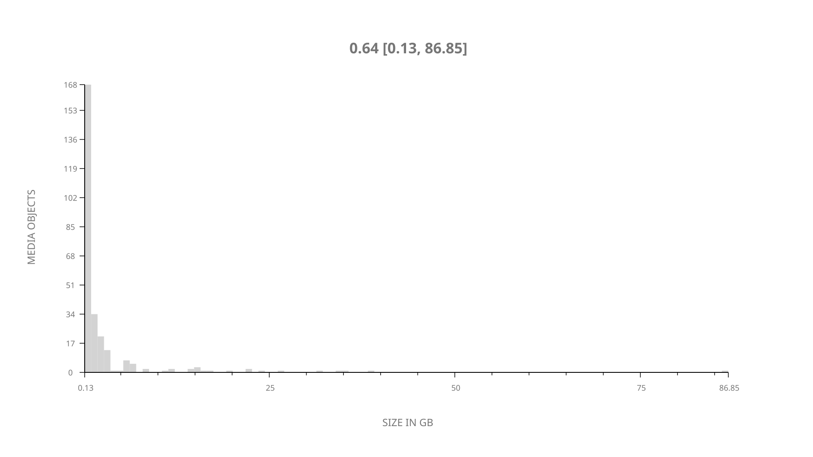
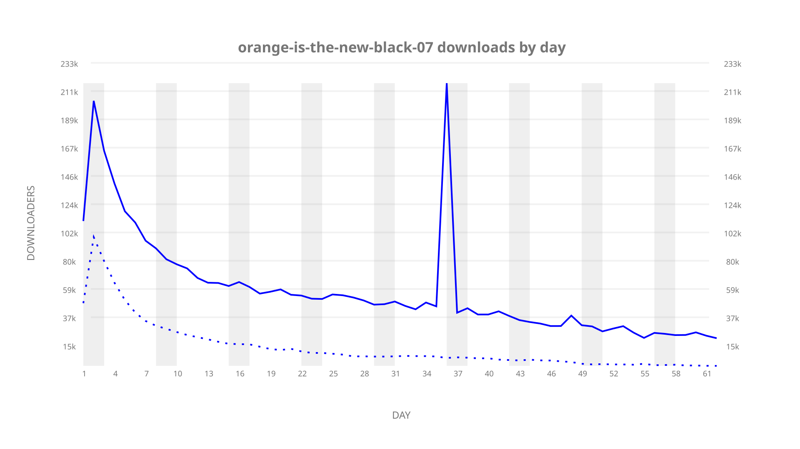
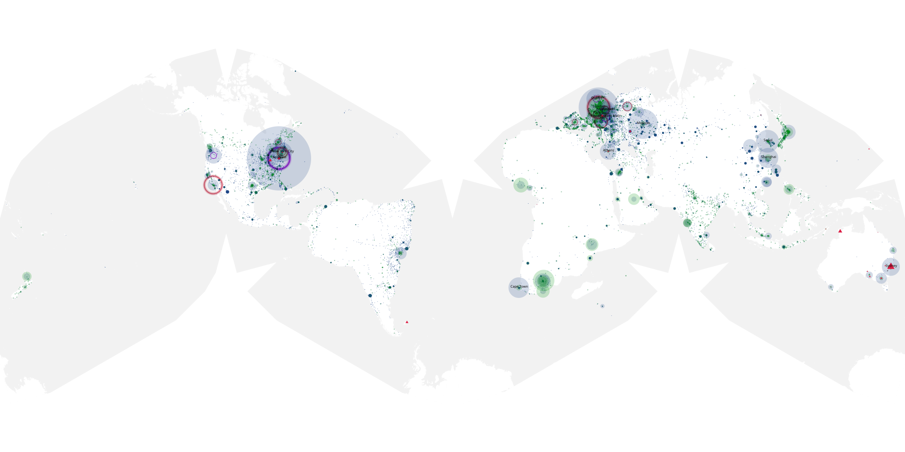
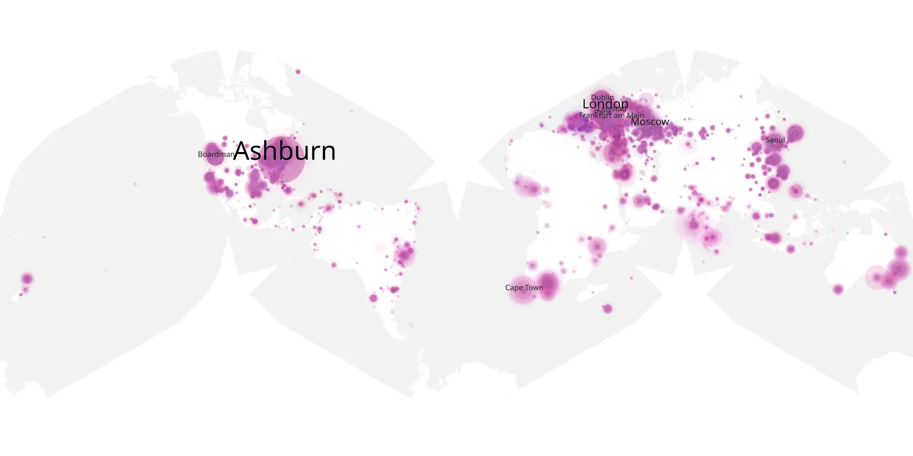
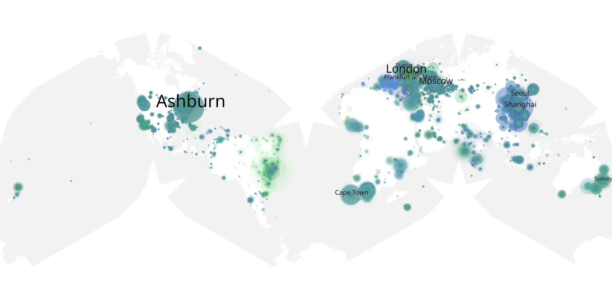

# orange-is-the-new-black-07 sample cache audit

## 1. Media object

| Field | Value |
| --- | --- |
| Media object | Orange Is The New Black |
| Collection key | `orange-is-the-new-black-07` |
| imdb_id | [tt2372162](https://www.imdb.com/title/tt2372162/) |
| wikipedia_url | [Orange Is the New Black](https://en.wikipedia.org/wiki/Orange_Is_the_New_Black) |
| Sample dates | 2019-07-26-to-2019-10-03 |
| Sample days | 70 |
| BTIH count | 284 |
| Unique BTIH count | 272 |
| Downloaders total | 2,500,392 |
| Uploaders total | 863,074 |
| Data version | `2026-08-05` |
| IP geolocation version | `6:1777968300` |

## 2. Sample coverage report

- Generated: 2026-09-05T07:27:37Z
- Evidence: read-only Day-member stream of the selected cache archive; no raw sample contents were opened
- Selected archive: cache.20191003.tar.xz
- Required sample span: 2019-07-26 to 2019-10-03 (70 days)
- Cache Day products: 62
- Sparse Day indices: 8
- Post-release Day products: 0

### Sample archive discontinuities

- missing Day index: 43
- missing Day index: 50
- missing Day index: 51
- missing Day index: 52
- missing Day index: 53
- missing Day index: 54
- missing Day index: 55
- missing Day index: 56

## 3. Media objects file size histogram

## 4. Visualization pass — graphs

### Downloads by week cumulative (normalized start)



### Downloads by day, Saturday and Sunday in gray

## 5. Visualization pass — maps

### Cumulative geographic slices

| Africa | Americas | Asia | Europe | Oceania | Unknown |
| --- | --- | --- | --- | --- | --- |
| 7.21 | 26.46 | 20.57 | 35.72 | 3.47 | 4.01 |

### Cumulative network infrastructure

{:target="_blank" rel="noopener"}

### Cumulative data maps

**Cumulative >= 1080p**

{:target="_blank" rel="noopener"}

**Cumulative < 1080p**

{:target="_blank" rel="noopener"}
