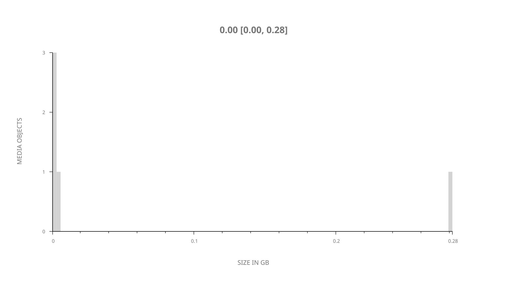
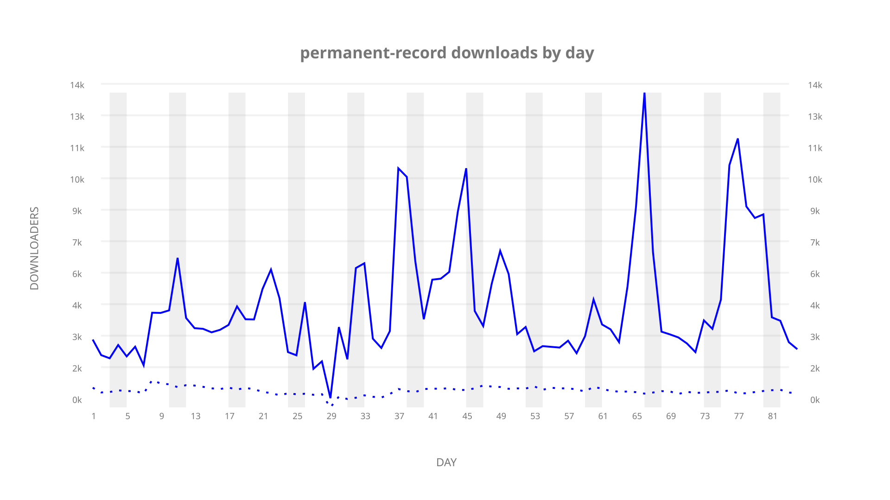
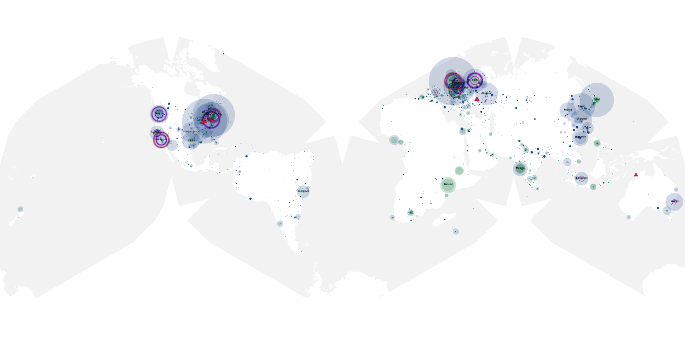
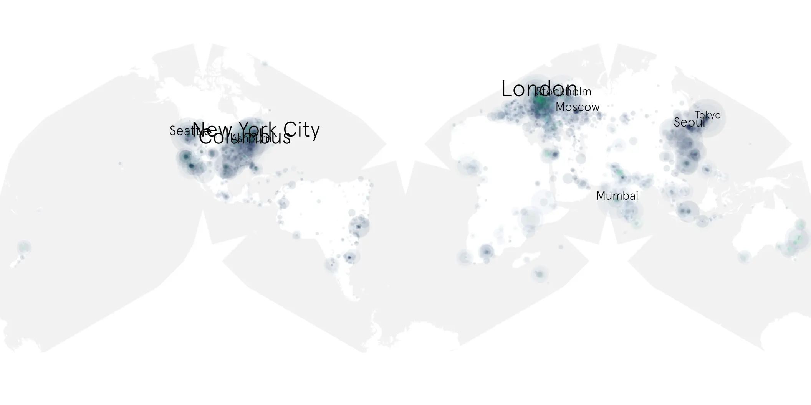

# permanent-record sample cache audit

## 1. Media object

| Field | Value |
| --- | --- |
| Media object | Permanent Record |
| Collection key | `permanent-record` |
| imdb_id | UNAVAILABLE |
| wikipedia_url | [Permanent Record (autobiography)](https://en.wikipedia.org/wiki/Permanent_Record_(autobiography)) |
| Sample dates | 2019-09-18-to-2019-12-10 |
| Sample days | 84 |
| BTIH count | 5 |
| Unique BTIH count | 5 |
| Downloaders total | 211,900 |
| Uploaders total | 34,805 |
| Data version | `2026-08-05` |
| IP geolocation version | `6:1777968300` |

## 2. Sample coverage report

- Generated: 2026-09-06T23:35:37Z
- Evidence: read-only Day-member stream of the selected cache archive; no raw sample contents were opened
- Selected archive: cache.20191210.tar.xz
- Required sample span: 2019-09-18 to 2019-12-10 (84 days)
- Cache Day products: 84
- Sparse Day indices: 0
- Post-release Day products: 0

### Sample archive discontinuities

None detected.

## 3. Media objects file size histogram

## 4. Visualization pass — graphs

### Downloads by week cumulative (normalized start)



### Downloads by day, Saturday and Sunday in gray

## 5. Visualization pass — maps

### Cumulative geographic slices

| Africa | Americas | Asia | Europe | Oceania | Unknown |
| --- | --- | --- | --- | --- | --- |
| 3.68 | 22.33 | 14.05 | 18.45 | 1.49 | 5.47 |

### Cumulative network infrastructure

{:target="_blank" rel="noopener"}

### Cumulative data maps

**Cumulative >= 1080p**

UNAVAILABLE — no collection members at 1080p or 2160 resolution.

**Cumulative < 1080p**

{:target="_blank" rel="noopener"}
