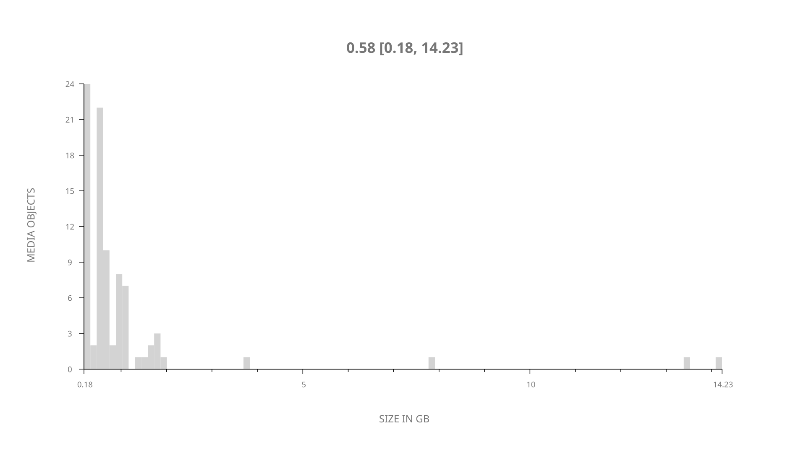
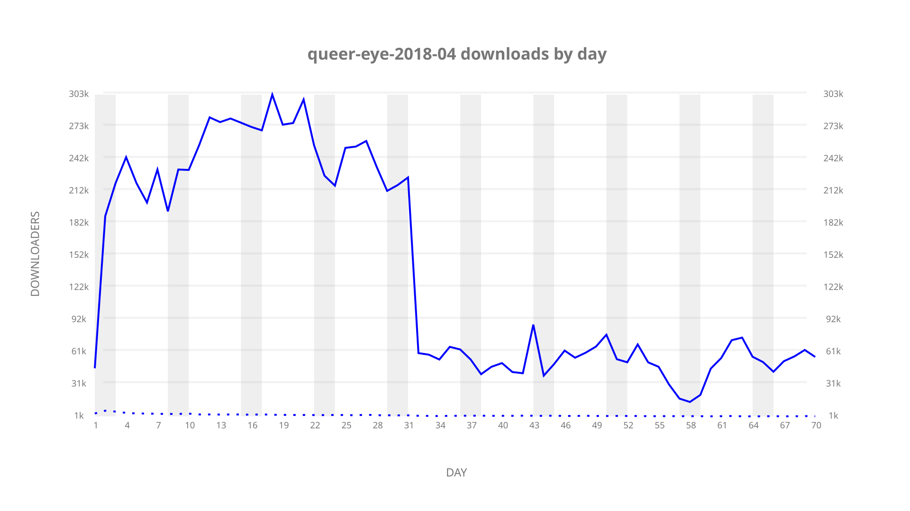
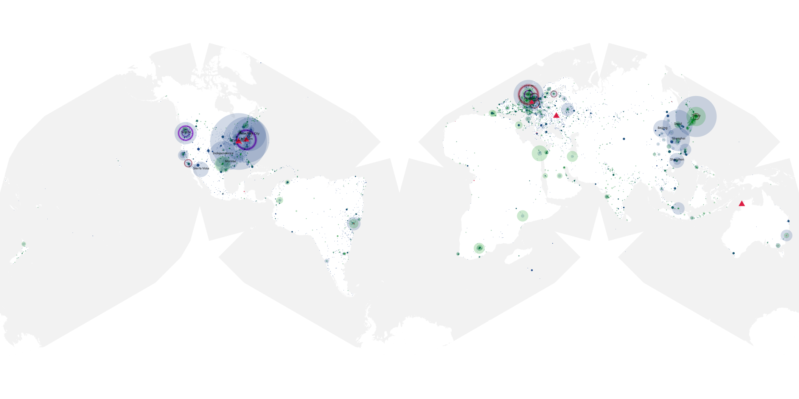
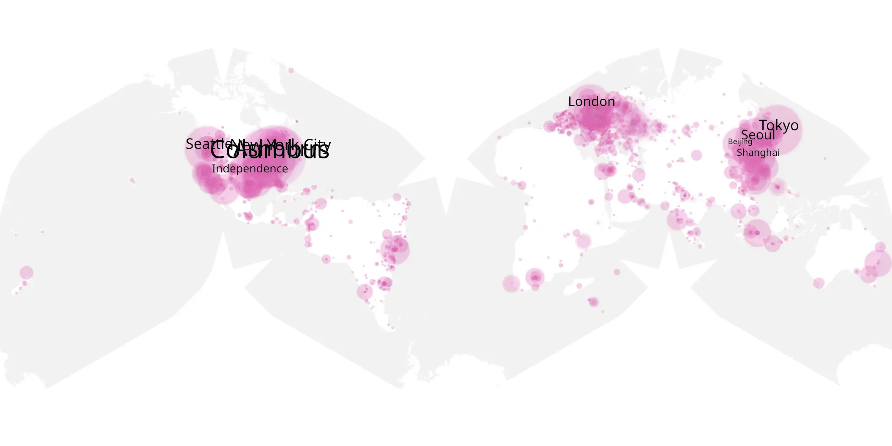
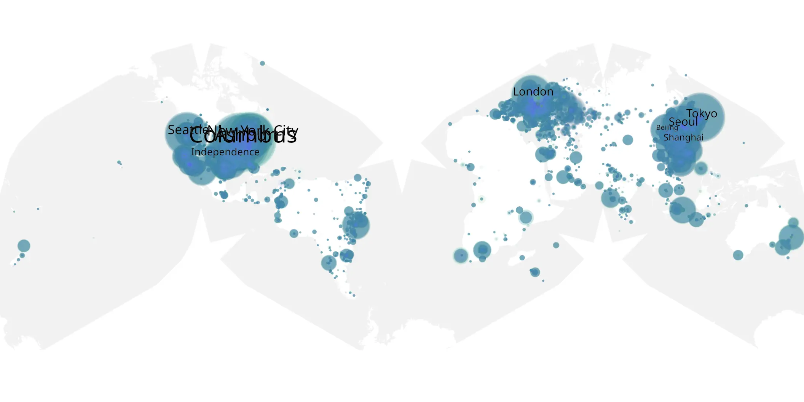

# queer-eye-2018-04 sample cache audit

## 1. Media object

| Field | Value |
| --- | --- |
| Media object | Queer Eye 2018 |
| Collection key | `queer-eye-2018-04` |
| imdb_id | [tt7259746](https://www.imdb.com/title/tt7259746/) |
| wikipedia_url | [Queer Eye (2018 TV series)](https://en.wikipedia.org/wiki/Queer_Eye_(2018_TV_series)) |
| Sample dates | 2019-07-19-to-2019-09-26 |
| Sample days | 70 |
| BTIH count | 91 |
| Unique BTIH count | 87 |
| Downloaders total | 2,798,123 |
| Uploaders total | 85,246 |
| Data version | `2026-08-05` |
| IP geolocation version | `6:1777968300` |

## 2. Sample coverage report

- Generated: 2026-09-05T07:27:37Z
- Evidence: read-only Day-member stream of the selected cache archive; no raw sample contents were opened
- Selected archive: cache.20190926.tar.xz
- Required sample span: 2019-07-19 to 2019-09-26 (70 days)
- Cache Day products: 70
- Sparse Day indices: 0
- Post-release Day products: 0

### Sample archive discontinuities

None detected.

## 3. Media objects file size histogram

## 4. Visualization pass — graphs

### Downloads by week cumulative (normalized start)



### Downloads by day, Saturday and Sunday in gray

## 5. Visualization pass — maps

### Cumulative geographic slices

| Africa | Americas | Asia | Europe | Oceania | Unknown |
| --- | --- | --- | --- | --- | --- |
| 2.37 | 39.13 | 19.99 | 19.76 | 1.44 | 13.30 |

### Cumulative network infrastructure

{:target="_blank" rel="noopener"}

### Cumulative data maps

**Cumulative >= 1080p**

{:target="_blank" rel="noopener"}

**Cumulative < 1080p**

{:target="_blank" rel="noopener"}
