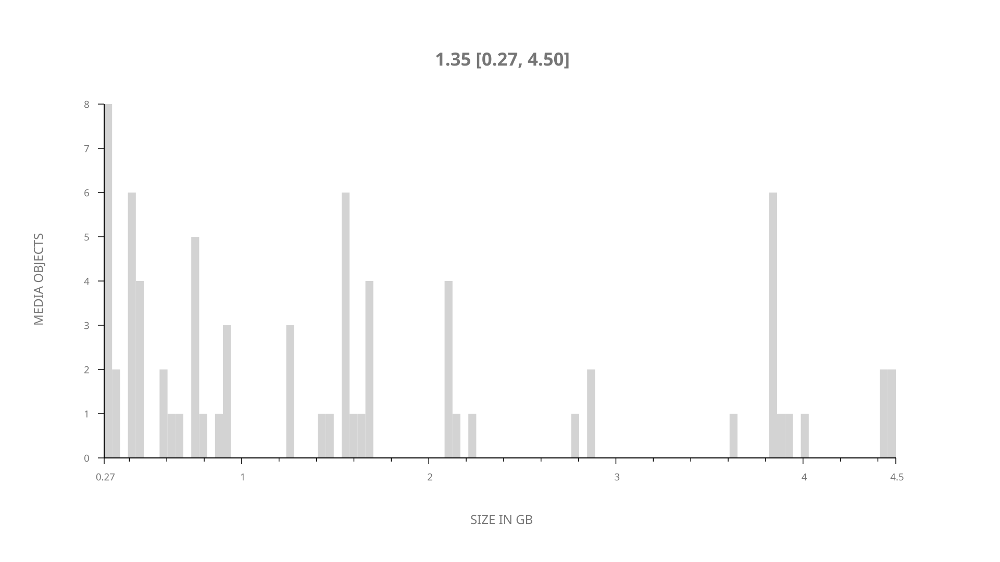
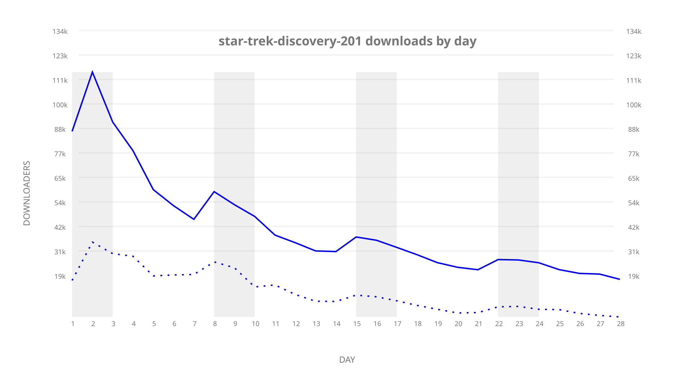
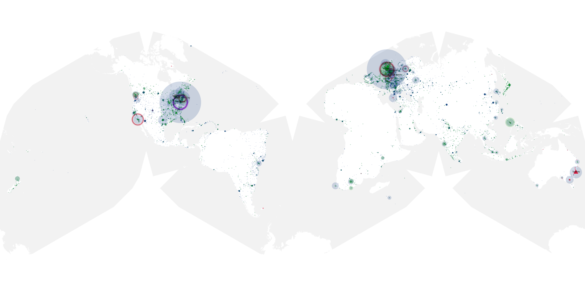
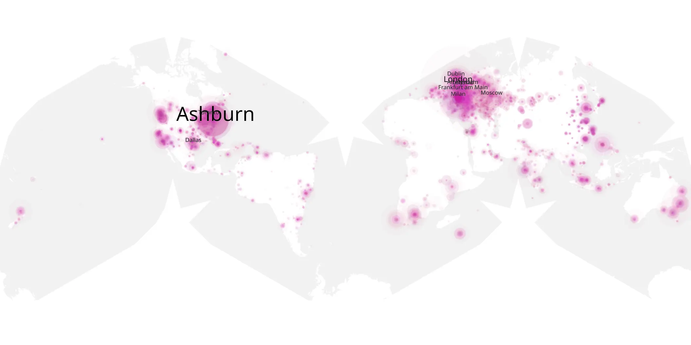
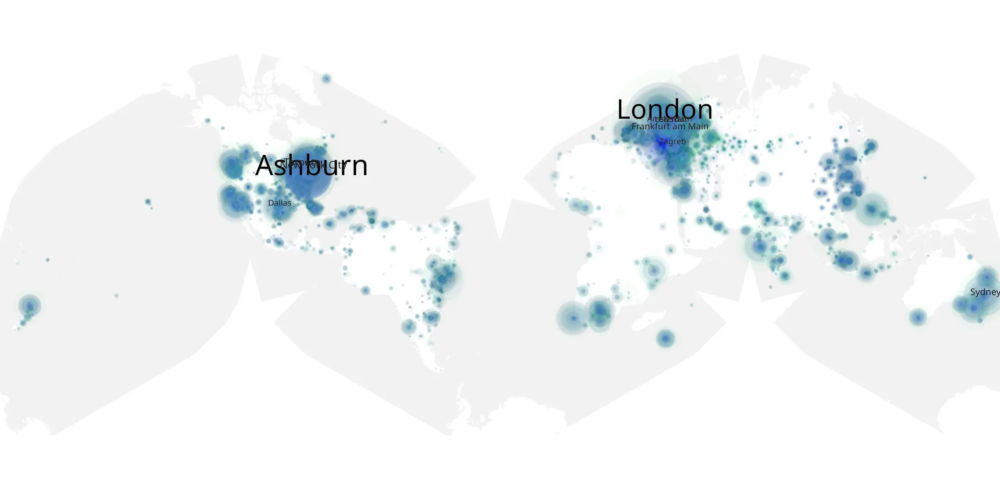

# star-trek-discovery-201 sample cache audit

## 1. Media object

| Field | Value |
| --- | --- |
| Media object | Star Trek Discovery |
| Collection key | `star-trek-discovery-201` |
| imdb_id | [tt5171438](https://www.imdb.com/title/tt5171438/) |
| wikipedia_url | [Star Trek: Discovery](https://en.wikipedia.org/wiki/Star_Trek:_Discovery) |
| Sample dates | 2019-01-18-to-2019-02-14 |
| Sample days | 28 |
| BTIH count | 99 |
| Unique BTIH count | 74 |
| Downloaders total | 1,250,401 |
| Uploaders total | 574,332 |
| Data version | `2026-08-05` |
| IP geolocation version | `6:1777968300` |

## 2. Sample coverage report

- Generated: 2026-09-05T07:27:37Z
- Evidence: read-only Day-member stream of the selected cache archive; no raw sample contents were opened
- Selected archive: cache.20190214.tar.xz
- Required sample span: 2019-01-18 to 2019-02-14 (28 days)
- Cache Day products: 28
- Sparse Day indices: 0
- Post-release Day products: 0

### Sample archive discontinuities

None detected.

## 3. Media objects file size histogram

## 4. Visualization pass — graphs

### Downloads by week cumulative (normalized start)



### Downloads by day, Saturday and Sunday in gray

## 5. Visualization pass — maps

### Cumulative geographic slices

| Africa | Americas | Asia | Europe | Oceania | Unknown |
| --- | --- | --- | --- | --- | --- |
| 3.96 | 32.65 | 12.52 | 35.77 | 3.82 | 1.14 |

### Cumulative network infrastructure

{:target="_blank" rel="noopener"}

### Cumulative data maps

**Cumulative >= 1080p**

{:target="_blank" rel="noopener"}

**Cumulative < 1080p**

{:target="_blank" rel="noopener"}
