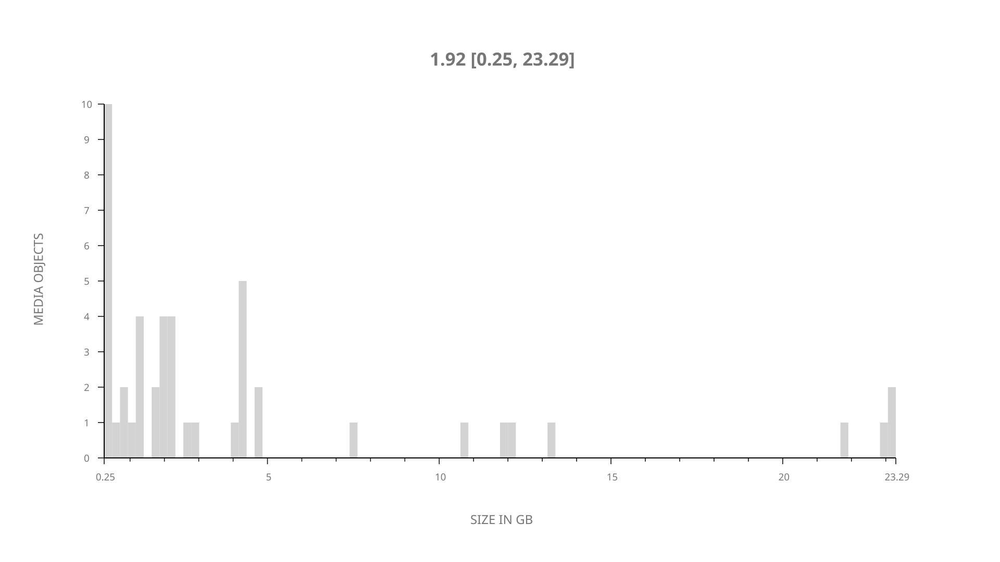
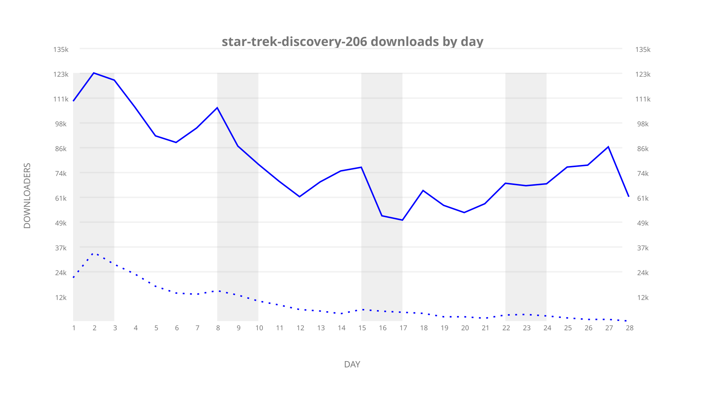
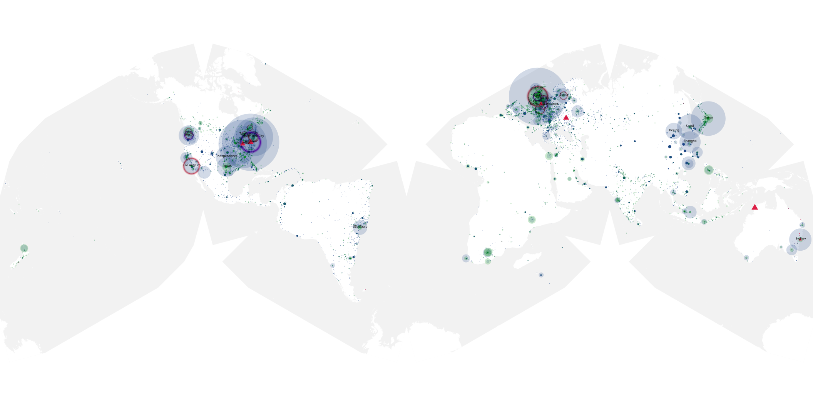
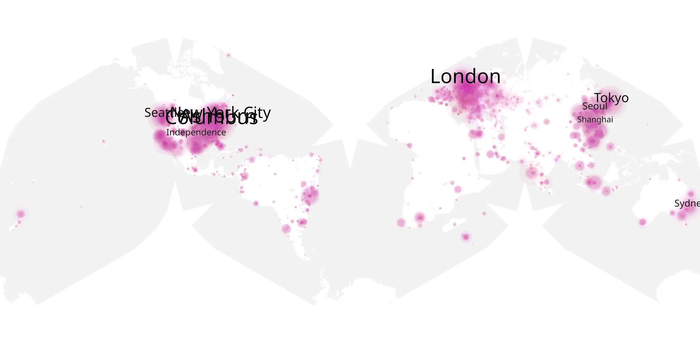
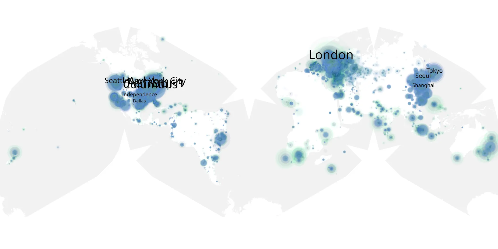

# star-trek-discovery-206 sample cache audit

## 1. Media object

| Field | Value |
| --- | --- |
| Media object | Star Trek Discovery |
| Collection key | `star-trek-discovery-206` |
| imdb_id | [tt5171438](https://www.imdb.com/title/tt5171438/) |
| wikipedia_url | [Star Trek: Discovery](https://en.wikipedia.org/wiki/Star_Trek:_Discovery) |
| Sample dates | 2019-02-22-to-2019-03-21 |
| Sample days | 28 |
| BTIH count | 51 |
| Unique BTIH count | 47 |
| Downloaders total | 1,597,921 |
| Uploaders total | 297,757 |
| Data version | `2026-08-05` |
| IP geolocation version | `6:1777968300` |

## 2. Sample coverage report

- Generated: 2026-09-06T23:35:37Z
- Evidence: read-only Day-member stream of the selected cache archive; no raw sample contents were opened
- Selected archive: cache.20190321.tar.xz
- Required sample span: 2019-02-22 to 2019-03-21 (28 days)
- Cache Day products: 28
- Sparse Day indices: 0
- Post-release Day products: 0

### Sample archive discontinuities

None detected.

## 3. Media objects file size histogram

## 4. Visualization pass — graphs

### Downloads by week cumulative (normalized start)



### Downloads by day, Saturday and Sunday in gray

## 5. Visualization pass — maps

### Cumulative geographic slices

| Africa | Americas | Asia | Europe | Oceania | Unknown |
| --- | --- | --- | --- | --- | --- |
| 3.04 | 36.70 | 16.90 | 24.73 | 2.43 | 9.11 |

### Cumulative network infrastructure

{:target="_blank" rel="noopener"}

### Cumulative data maps

**Cumulative >= 1080p**

{:target="_blank" rel="noopener"}

**Cumulative < 1080p**

{:target="_blank" rel="noopener"}
