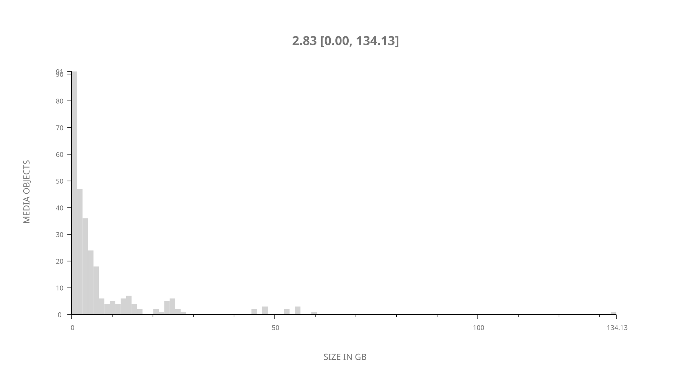
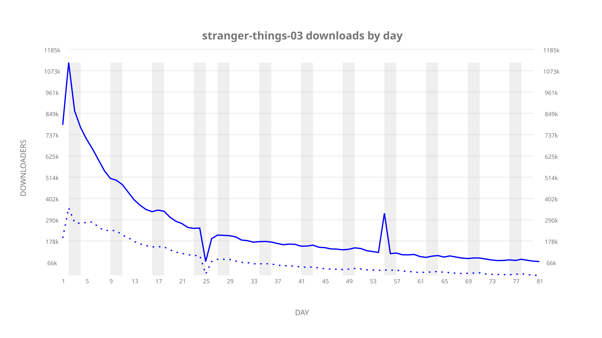
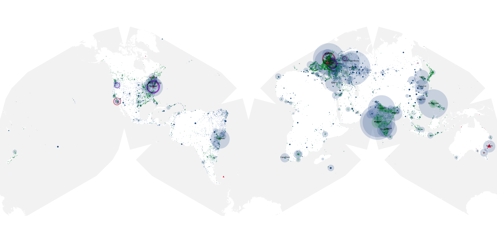
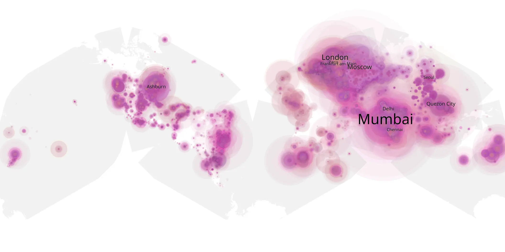
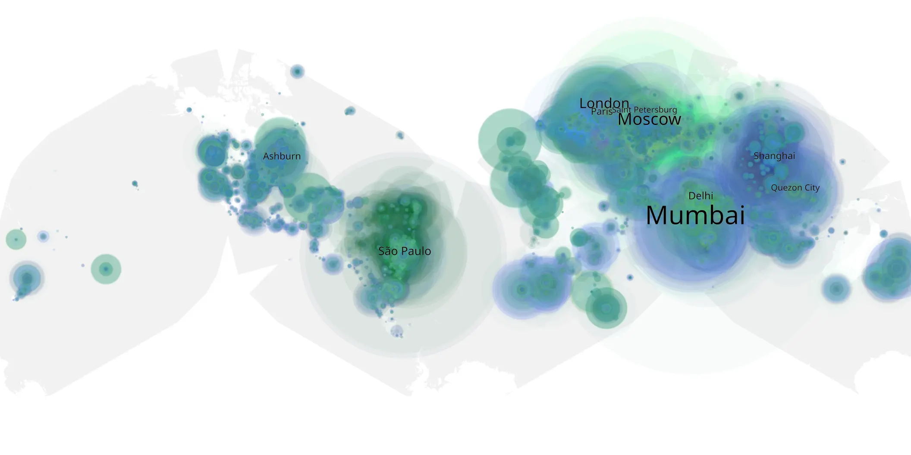

# stranger-things-03 sample cache audit

## 1. Media object

| Field | Value |
| --- | --- |
| Media object | Stranger Things |
| Collection key | `stranger-things-03` |
| imdb_id | [tt4574334](https://www.imdb.com/title/tt4574334/) |
| wikipedia_url | [Stranger Things](https://en.wikipedia.org/wiki/Stranger_Things) |
| Sample dates | 2019-07-04-to-2019-09-25 |
| Sample days | 84 |
| BTIH count | 326 |
| Unique BTIH count | 283 |
| Downloaders total | 16,073,595 |
| Uploaders total | 7,289,132 |
| Data version | `2026-08-05` |
| IP geolocation version | `6:1777968300` |

## 2. Coverage report

- Generated: 2026-09-05T07:27:37Z
- Evidence: read-only Day-member stream of the selected cache archive; no raw sample contents were opened
- Selected archive: cache.20190925.tar.xz
- Required sample span: 2019-07-04 to 2019-09-25 (84 days)
- Cache Day products: 81
- Sparse Day indices: 3
- Post-release Day products: 0

### Sample archive discontinuities

- missing Day index: 26
- missing Day index: 27
- missing Day index: 28

## 3. File sizes histogram *median[lowest, highest]*

## 4. Graphs

### Downloads by week cumulative (normalized start)



### Downloads by day, Saturday and Sunday in gray

## 5. Cumulative Maps

<!-- https://raw.githubusercontent.com/alpha60-devops/alpha60-results-2019/refs/heads/main/data/ -->

### <a href="https://raw.githubusercontent.com/alpha60-devops/alpha60-results-2019/refs/heads/main/data/geojson.cumulative/stranger-things-03-cumulative-aggregate.geojson.gz" data-map-title="Stranger Things — stranger-things-03" onclick="leaflet_map_open_window(this.href, this.dataset.mapTitle); return false;" class="table-link" aria-label="Open Stranger Things (stranger-things-03) cumulative data map in new window" title="Opens interactive map for Stranger Things (stranger-things-03) data">Swarm Detail</a>

### Geographic Regions

| Africa | Americas | Asia | Europe | Oceania | Unknown |
| --- | --- | --- | --- | --- | --- |
| 8.16 | 18.11 | 31.45 | 33.55 | 2.12 | 1.24 |

### Network infrastructure

{:target="_blank" rel="noopener"}

### Resolution >= 1080p

{:target="_blank" rel="noopener"}

### Resolution < 1080p

{:target="_blank" rel="noopener"}
