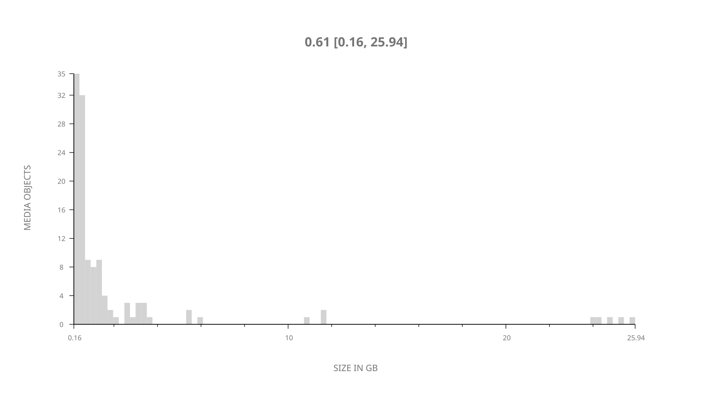
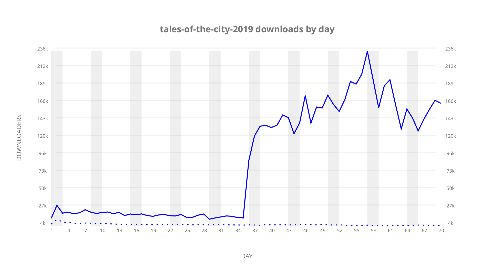
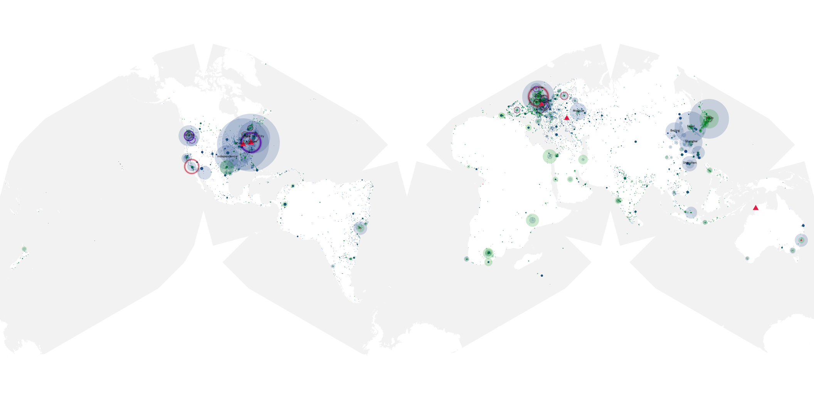
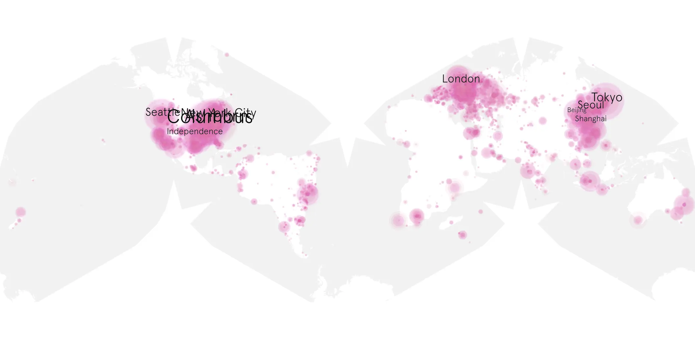
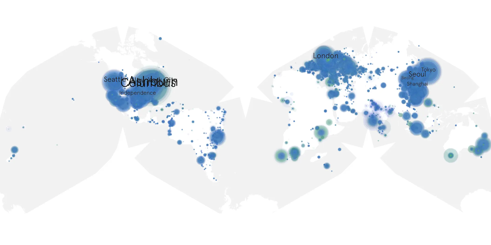

# tales-of-the-city-2019 sample cache audit

## 1. Media object

| Field | Value |
| --- | --- |
| Media object | Tales of the City 2019 |
| Collection key | `tales-of-the-city-2019` |
| imdb_id | [tt7087260](https://www.imdb.com/title/tt7087260/) |
| wikipedia_url | [Tales of the City (2019 miniseries)](https://en.wikipedia.org/wiki/Tales_of_the_City_(2019_miniseries)) |
| Sample dates | 2019-06-07-to-2019-08-15 |
| Sample days | 70 |
| BTIH count | 141 |
| Unique BTIH count | 122 |
| Downloaders total | 3,677,496 |
| Uploaders total | 241,294 |
| Data version | `2026-08-05` |
| IP geolocation version | `6:1777968300` |

## 2. Sample coverage report

- Generated: 2026-09-05T07:27:37Z
- Evidence: read-only Day-member stream of the selected cache archive; no raw sample contents were opened
- Selected archive: cache.20190815.tar.xz
- Required sample span: 2019-06-07 to 2019-08-15 (70 days)
- Cache Day products: 70
- Sparse Day indices: 0
- Post-release Day products: 0

### Sample archive discontinuities

None detected.

## 3. Media objects file size histogram

## 4. Visualization pass — graphs

### Downloads by week cumulative (normalized start)



### Downloads by day, Saturday and Sunday in gray

## 5. Visualization pass — maps

### Cumulative geographic slices

| Africa | Americas | Asia | Europe | Oceania | Unknown |
| --- | --- | --- | --- | --- | --- |
| 2.97 | 37.48 | 20.52 | 22.43 | 1.70 | 11.93 |

### Cumulative network infrastructure

{:target="_blank" rel="noopener"}

### Cumulative data maps

**Cumulative >= 1080p**

{:target="_blank" rel="noopener"}

**Cumulative < 1080p**

{:target="_blank" rel="noopener"}
