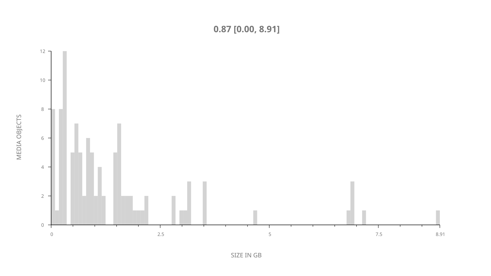
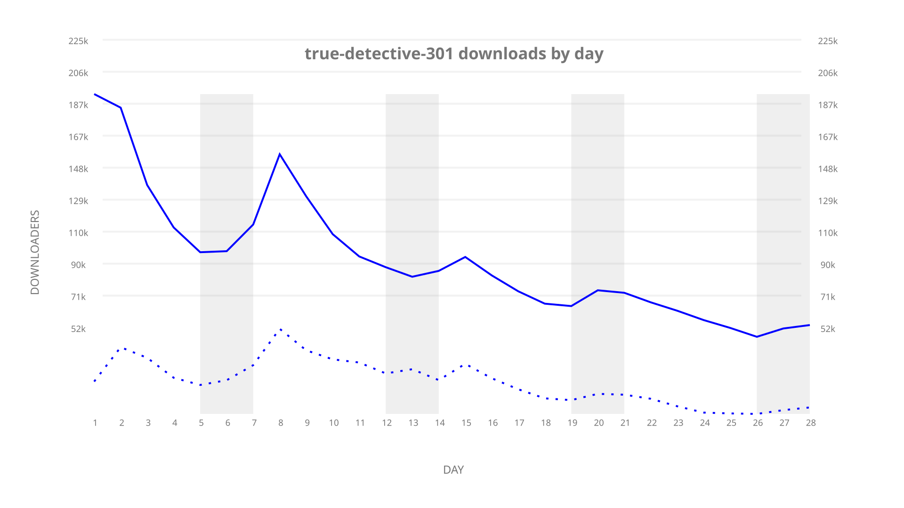
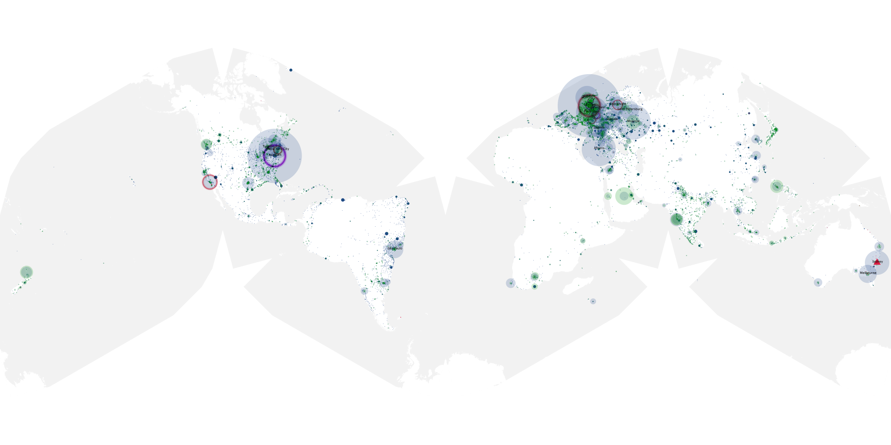
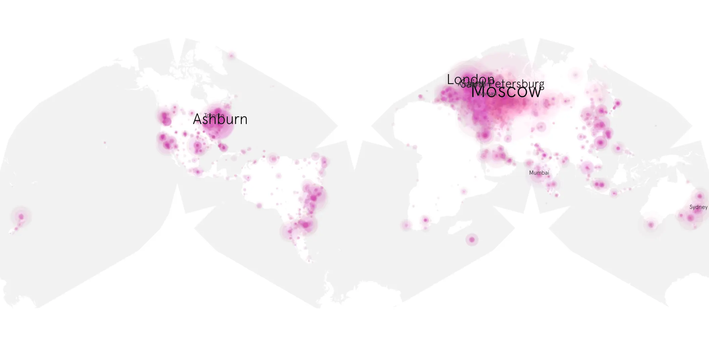
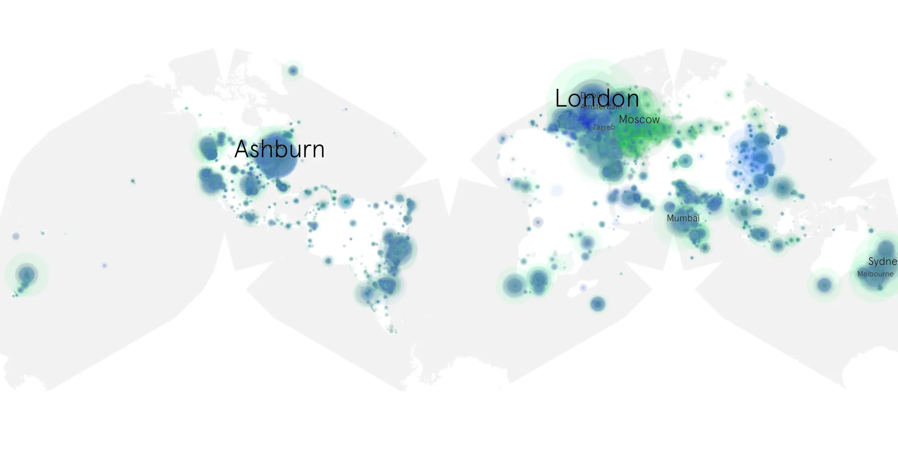

# true-detective-301 sample cache audit

## 1. Media object

| Field | Value |
| --- | --- |
| Media object | True Detective |
| Collection key | `true-detective-301` |
| imdb_id | [tt2356777](https://www.imdb.com/title/tt2356777/) |
| wikipedia_url | [True Detective](https://en.wikipedia.org/wiki/True_Detective) |
| Sample dates | 2019-01-14-to-2019-02-10 |
| Sample days | 28 |
| BTIH count | 132 |
| Unique BTIH count | 107 |
| Downloaders total | 2,726,570 |
| Uploaders total | 1,289,903 |
| Data version | `2026-08-05` |
| IP geolocation version | `6:1777968300` |

## 2. Sample coverage report

- Generated: 2026-09-06T23:35:37Z
- Evidence: read-only Day-member stream of the selected cache archive; no raw sample contents were opened
- Selected archive: cache.20190210.tar.xz
- Required sample span: 2019-01-14 to 2019-02-10 (28 days)
- Cache Day products: 28
- Sparse Day indices: 0
- Post-release Day products: 0

### Sample archive discontinuities

None detected.

## 3. Media objects file size histogram

## 4. Visualization pass — graphs

### Downloads by week cumulative (normalized start)



### Downloads by day, Saturday and Sunday in gray

## 5. Visualization pass — maps

### Cumulative geographic slices

| Africa | Americas | Asia | Europe | Oceania | Unknown |
| --- | --- | --- | --- | --- | --- |
| 3.37 | 24.39 | 15.95 | 43.81 | 4.07 | 0.93 |

### Cumulative network infrastructure

{:target="_blank" rel="noopener"}

### Cumulative data maps

**Cumulative >= 1080p**

{:target="_blank" rel="noopener"}

**Cumulative < 1080p**

{:target="_blank" rel="noopener"}
