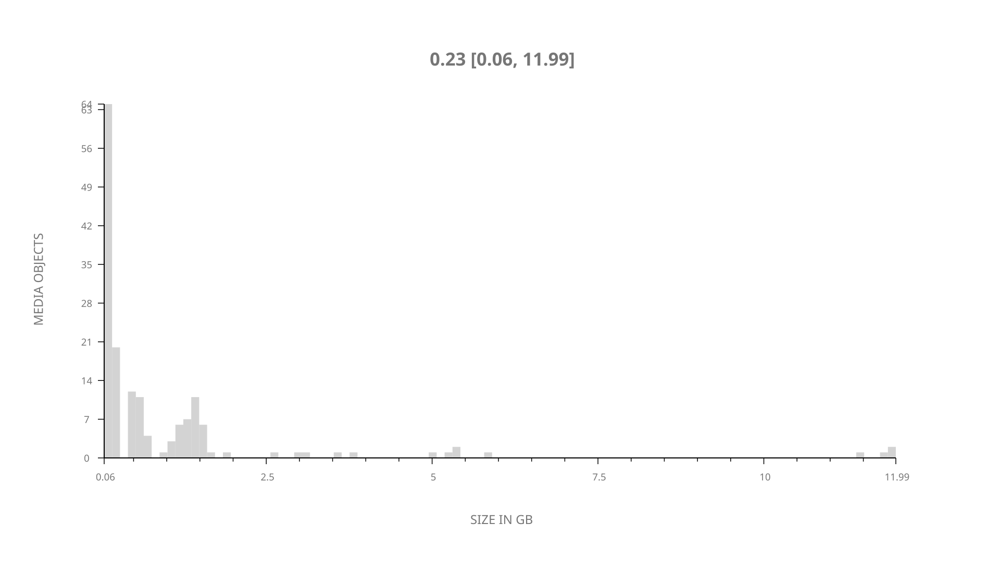
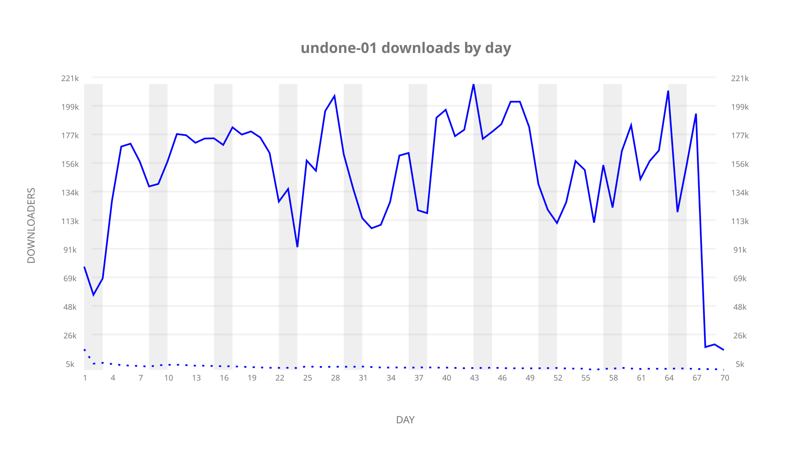
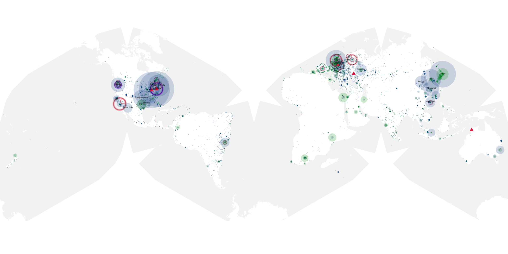
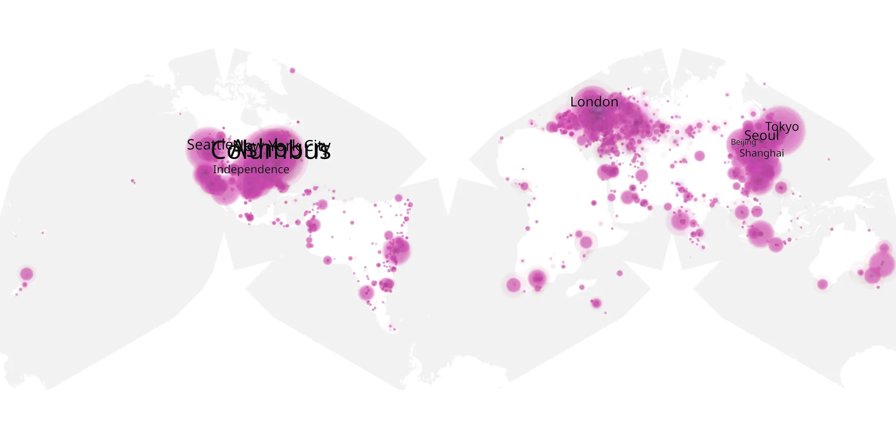
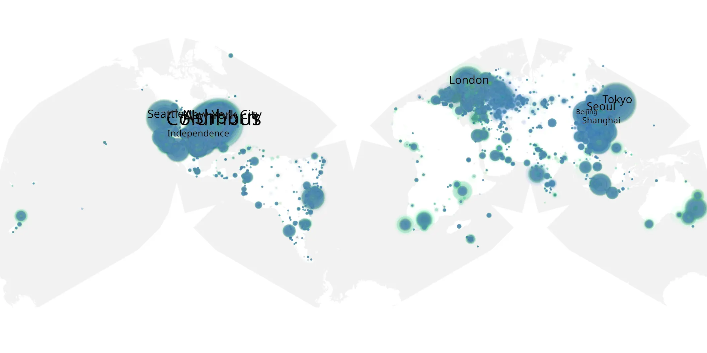

# undone-01 sample cache audit

## 1. Media object

| Field | Value |
| --- | --- |
| Media object | Undone |
| Collection key | `undone-01` |
| imdb_id | [tt8101850](https://www.imdb.com/title/tt8101850/) |
| wikipedia_url | [Undone (TV series)](https://en.wikipedia.org/wiki/Undone_(TV_series)) |
| Sample dates | 2019-09-13-to-2019-11-21 |
| Sample days | 70 |
| BTIH count | 176 |
| Unique BTIH count | 161 |
| Downloaders total | 5,286,167 |
| Uploaders total | 257,720 |
| Data version | `2026-08-05` |
| IP geolocation version | `6:1777968300` |

## 2. Coverage report

- Generated: 2026-09-05T07:27:37Z
- Evidence: read-only Day-member stream of the selected cache archive; no raw sample contents were opened
- Selected archive: cache.20191121.tar.xz
- Required sample span: 2019-09-13 to 2019-11-21 (70 days)
- Cache Day products: 70
- Sparse Day indices: 0
- Post-release Day products: 0

### Sample archive discontinuities

None detected.

## 3. File sizes histogram *median[lowest, highest]*

## 4. Graphs

### Downloads by week cumulative (normalized start)



### Downloads by day, Saturday and Sunday in gray

## 5. Cumulative Maps

<!-- https://raw.githubusercontent.com/alpha60-devops/alpha60-results-2019/refs/heads/main/data/ -->

### <a href="https://raw.githubusercontent.com/alpha60-devops/alpha60-results-2019/refs/heads/main/data/geojson.cumulative/undone-01-cumulative-aggregate.geojson.gz" data-map-title="Undone — undone-01" onclick="leaflet_map_open_window(this.href, this.dataset.mapTitle); return false;" class="table-link" aria-label="Open Undone (undone-01) cumulative data map in new window" title="Opens interactive map for Undone (undone-01) data">Swarm Detail</a>

### Geographic Regions

| Africa | Americas | Asia | Europe | Oceania | Unknown |
| --- | --- | --- | --- | --- | --- |
| 2.60 | 38.53 | 20.47 | 22.06 | 1.66 | 12.60 |

### Network infrastructure

{:target="_blank" rel="noopener"}

### Resolution >= 1080p

{:target="_blank" rel="noopener"}

### Resolution < 1080p

{:target="_blank" rel="noopener"}
