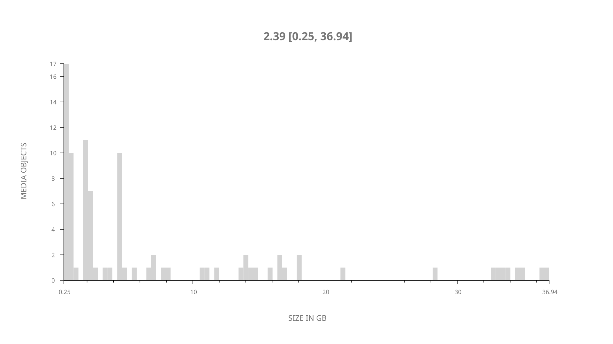
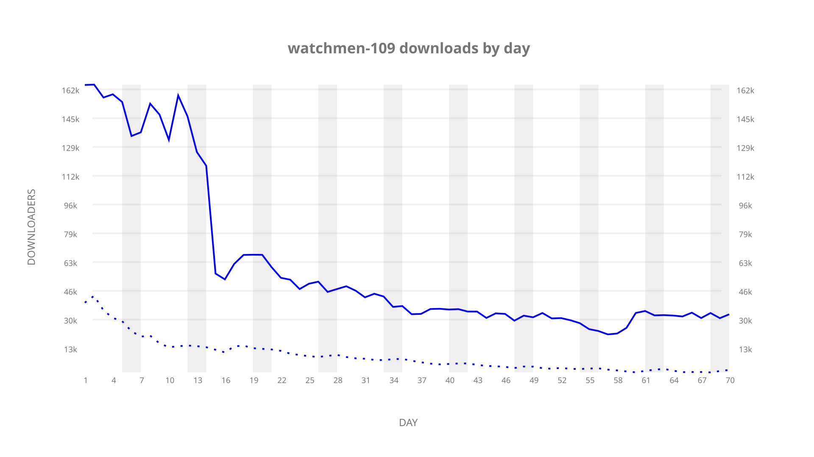
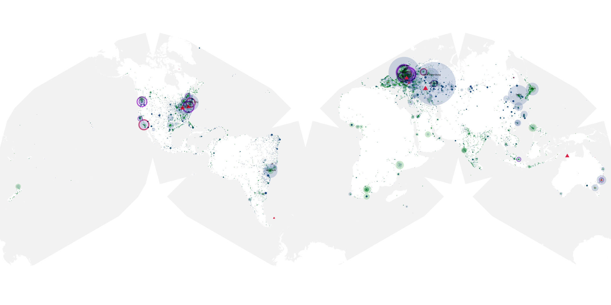
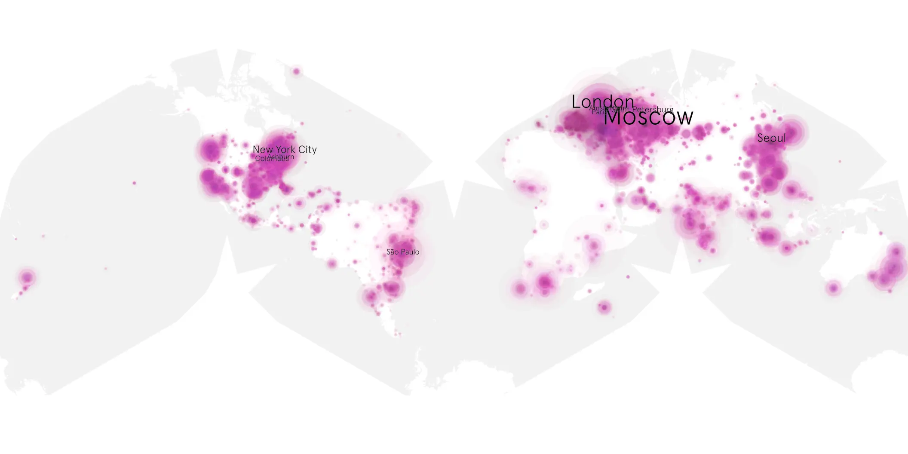
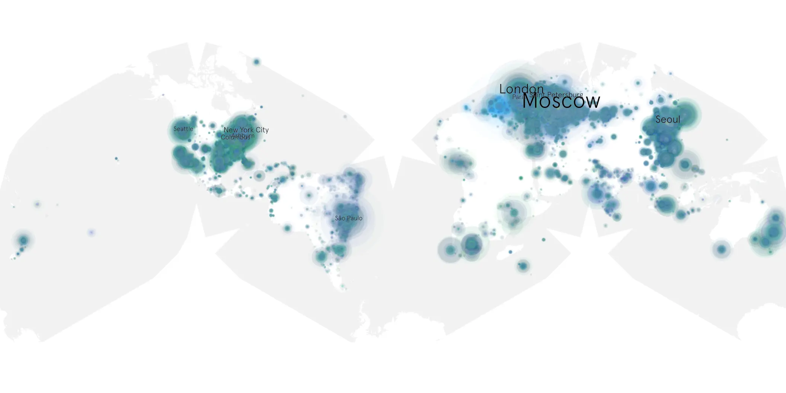

# watchmen-109 sample cache audit

## 1. Media object

| Field | Value |
| --- | --- |
| Media object | Watchmen |
| Collection key | `watchmen-109` |
| imdb_id | [tt7049682](https://www.imdb.com/title/tt7049682/) |
| wikipedia_url | [Watchmen (TV series)](https://en.wikipedia.org/wiki/Watchmen_(TV_series)) |
| Sample dates | 2019-12-16-to-2020-02-23 |
| Sample days | 70 |
| BTIH count | 101 |
| Unique BTIH count | 90 |
| Downloaders total | 3,151,650 |
| Uploaders total | 719,933 |
| Data version | `2026-08-05` |
| IP geolocation version | `6:1777968300` |

## 2. Coverage report

- Generated: 2026-09-05T07:27:37Z
- Evidence: read-only Day-member stream of the selected cache archive; no raw sample contents were opened
- Selected archive: cache.20200223.tar.xz
- Required sample span: 2019-12-16 to 2020-02-23 (70 days)
- Cache Day products: 70
- Sparse Day indices: 0
- Post-release Day products: 0

### Sample archive discontinuities

None detected.

## 3. File sizes histogram *median[lowest, highest]*

## 4. Graphs

### Downloads by week cumulative (normalized start)



### Downloads by day, Saturday and Sunday in gray

## 5. Cumulative Maps

<!-- https://raw.githubusercontent.com/alpha60-devops/alpha60-results-2019/refs/heads/main/data/ -->

### <a href="https://raw.githubusercontent.com/alpha60-devops/alpha60-results-2019/refs/heads/main/data/geojson.cumulative/watchmen-109-cumulative-aggregate.geojson.gz" data-map-title="Watchmen — watchmen-109" onclick="leaflet_map_open_window(this.href, this.dataset.mapTitle); return false;" class="table-link" aria-label="Open Watchmen (watchmen-109) cumulative data map in new window" title="Opens interactive map for Watchmen (watchmen-109) data">Swarm Detail</a>

### Geographic Regions

| Africa | Americas | Asia | Europe | Oceania | Unknown |
| --- | --- | --- | --- | --- | --- |
| 3.16 | 28.76 | 17.01 | 38.89 | 2.26 | 4.87 |

### Network infrastructure

{:target="_blank" rel="noopener"}

### Resolution >= 1080p

{:target="_blank" rel="noopener"}

### Resolution < 1080p

{:target="_blank" rel="noopener"}
