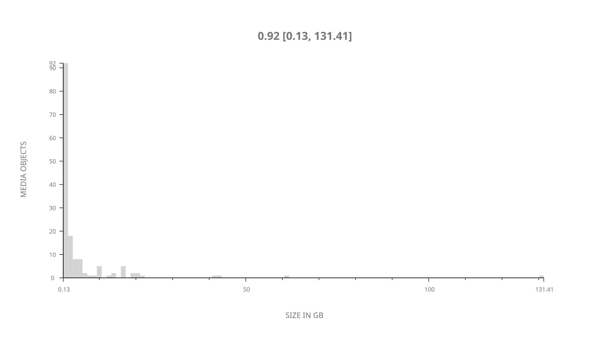
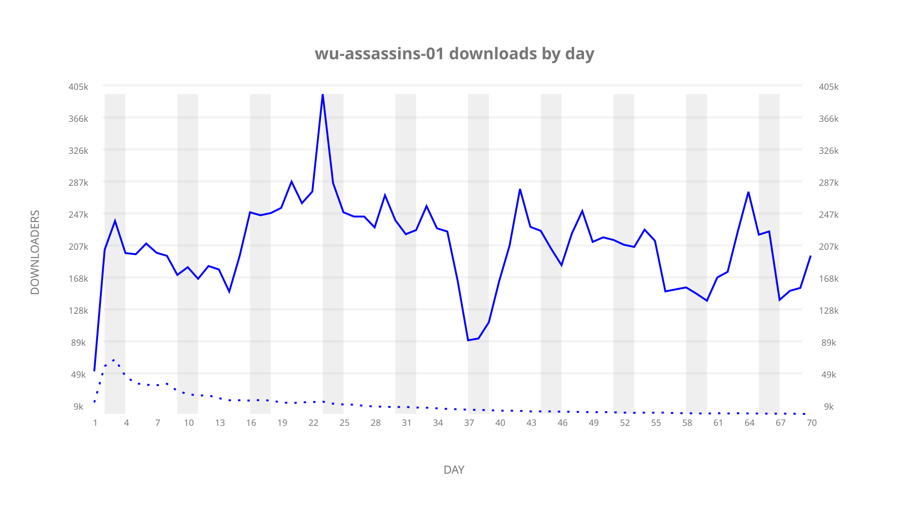
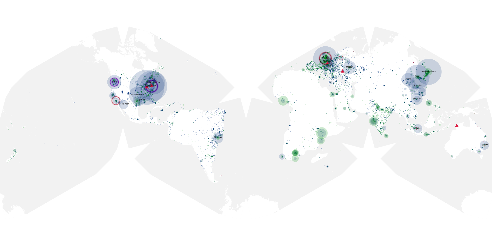
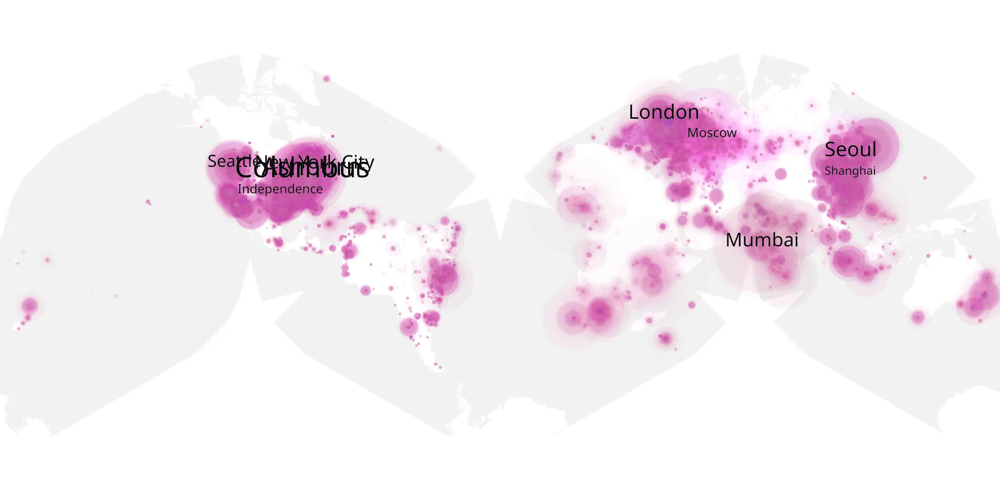
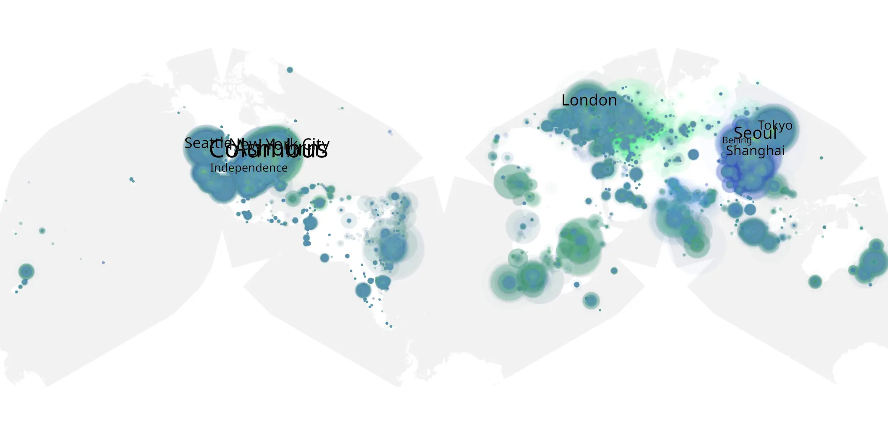

# wu-assassins-01 sample cache audit

## 1. Media object

| Field | Value |
| --- | --- |
| Media object | Wu Assassins |
| Collection key | `wu-assassins-01` |
| imdb_id | [tt8652642](https://www.imdb.com/title/tt8652642/) |
| wikipedia_url | [Wu Assassins](https://en.wikipedia.org/wiki/Wu_Assassins) |
| Sample dates | 2019-08-08-to-2019-10-16 |
| Sample days | 70 |
| BTIH count | 172 |
| Unique BTIH count | 152 |
| Downloaders total | 7,747,480 |
| Uploaders total | 909,901 |
| Data version | `2026-08-05` |
| IP geolocation version | `6:1777968300` |

## 2. Sample coverage report

- Generated: 2026-09-05T07:27:37Z
- Evidence: read-only Day-member stream of the selected cache archive; no raw sample contents were opened
- Selected archive: cache.20191016.tar.xz
- Required sample span: 2019-08-08 to 2019-10-16 (70 days)
- Cache Day products: 70
- Sparse Day indices: 0
- Post-release Day products: 0

### Sample archive discontinuities

None detected.

## 3. Media objects file size histogram

## 4. Visualization pass — graphs

### Downloads by week cumulative (normalized start)



### Downloads by day, Saturday and Sunday in gray

## 5. Visualization pass — maps

### Cumulative geographic slices

| Africa | Americas | Asia | Europe | Oceania | Unknown |
| --- | --- | --- | --- | --- | --- |
| 4.87 | 34.38 | 23.35 | 21.81 | 1.61 | 10.68 |

### Cumulative network infrastructure

{:target="_blank" rel="noopener"}

### Cumulative data maps

**Cumulative >= 1080p**

{:target="_blank" rel="noopener"}

**Cumulative < 1080p**

{:target="_blank" rel="noopener"}
