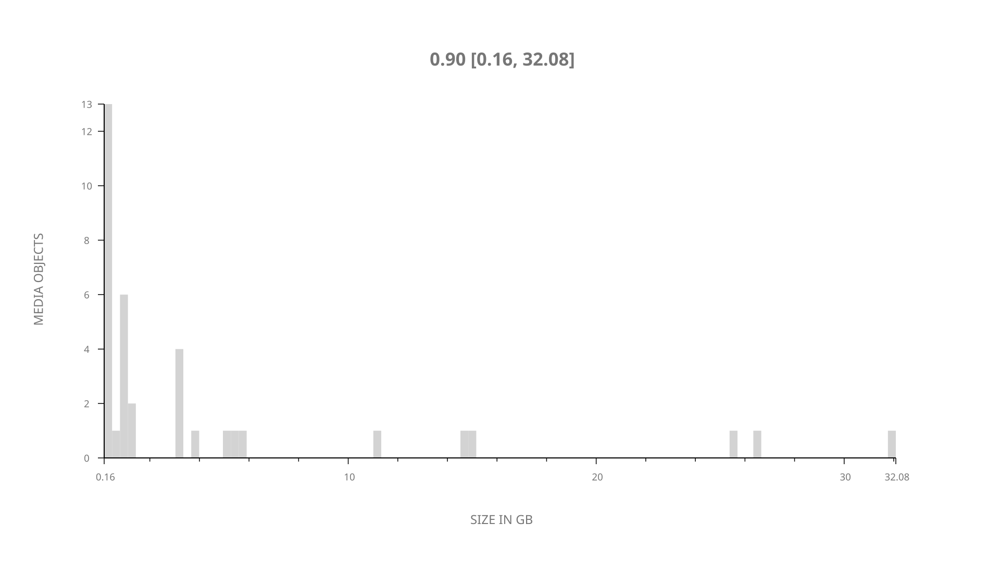
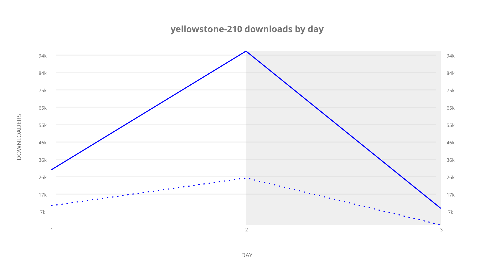
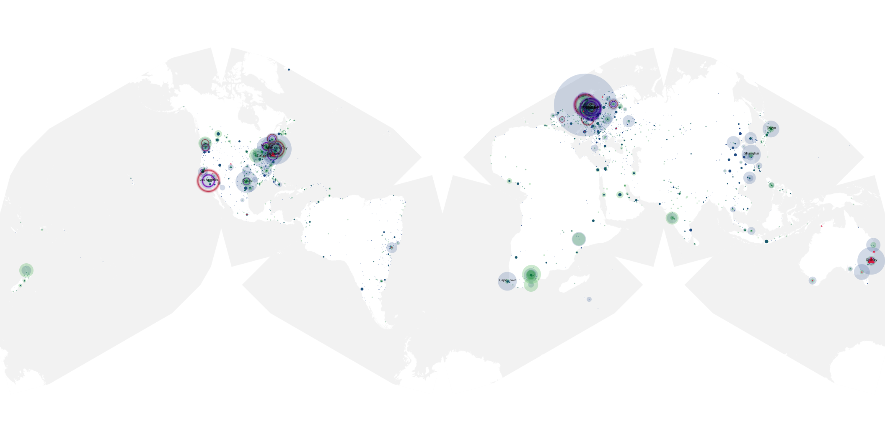
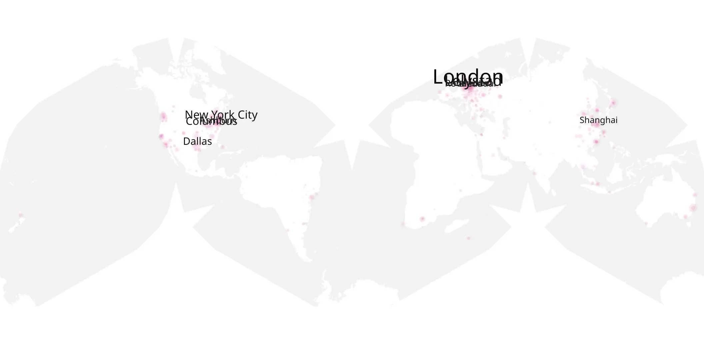
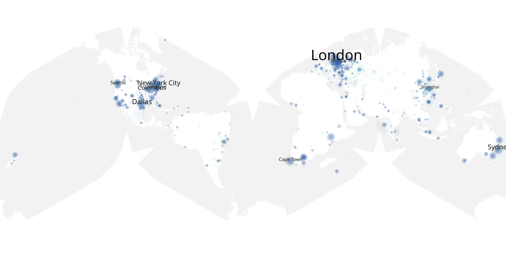

# yellowstone-210 sample cache audit

## 1. Media object

| Field | Value |
| --- | --- |
| Media object | Yellowstone |
| Collection key | `yellowstone-210` |
| imdb_id | [tt4236770](https://www.imdb.com/title/tt4236770/) |
| wikipedia_url | [Yellowstone (TV series)](https://en.wikipedia.org/wiki/Yellowstone_(TV_series)) |
| Sample dates | 2019-08-29-to-2019-08-31 |
| Sample days | 3 |
| BTIH count | 45 |
| Unique BTIH count | 36 |
| Downloaders total | 175,496 |
| Uploaders total | 63,301 |
| Data version | `2026-08-05` |
| IP geolocation version | `6:1777968300` |

## 2. Coverage report

- Generated: 2026-09-06T23:35:37Z
- Evidence: read-only Day-member stream of the selected cache archive; no raw sample contents were opened
- Selected archive: cache.20190831.tar.xz
- Required sample span: 2019-08-29 to 2019-08-31 (3 days)
- Cache Day products: 3
- Sparse Day indices: 0
- Post-release Day products: 0

### Sample archive discontinuities

None detected.

## 3. File sizes histogram *median[lowest, highest]*

## 4. Graphs

### Downloads by week cumulative (normalized start)



### Downloads by day, Saturday and Sunday in gray

## 5. Cumulative Maps

<!-- https://raw.githubusercontent.com/alpha60-devops/alpha60-results-2019/refs/heads/main/data/ -->

### <a href="https://raw.githubusercontent.com/alpha60-devops/alpha60-results-2019/refs/heads/main/data/geojson.cumulative/yellowstone-210-cumulative-aggregate.geojson.gz" data-map-title="Yellowstone — yellowstone-210" onclick="leaflet_map_open_window(this.href, this.dataset.mapTitle); return false;" class="table-link" aria-label="Open Yellowstone (yellowstone-210) cumulative data map in new window" title="Opens interactive map for Yellowstone (yellowstone-210) data">Swarm Detail</a>

### Geographic Regions

| Africa | Americas | Asia | Europe | Oceania | Unknown |
| --- | --- | --- | --- | --- | --- |
| 5.15 | 33.49 | 15.28 | 25.97 | 4.39 | 4.92 |

### Network infrastructure

{:target="_blank" rel="noopener"}

### Resolution >= 1080p

{:target="_blank" rel="noopener"}

### Resolution < 1080p

{:target="_blank" rel="noopener"}
